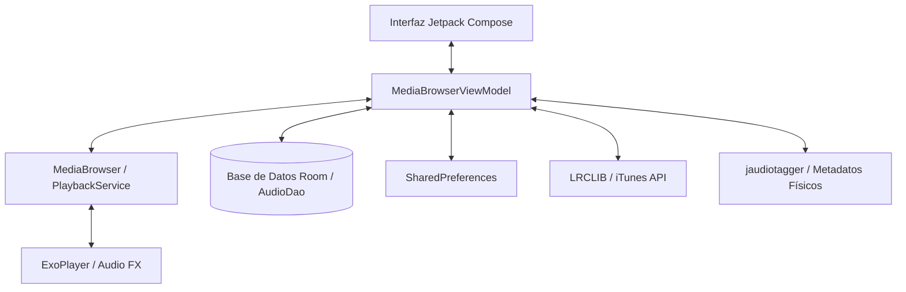

# Contexto del Proyecto: KevMusicPlayer

Este documento proporciona una descripción detallada del estado actual, la arquitectura técnica, las características implementadas y las pautas de desarrollo de **KevMusicPlayer**, un reproductor de música premium optimizado para dispositivos Android.

---

## 1. Arquitectura General y Flujo de Datos

KevMusicPlayer utiliza un patrón de diseño **MVVM (Model-View-ViewModel)** complementado con componentes modernos de Android: **Jetpack Compose** para la interfaz de usuario, **Room** para persistencia local de la biblioteca, y **AndroidX Media3 (ExoPlayer)** para la lógica de reproducción de audio y servicios en segundo plano.



### Capas del Proyecto:
- **Capa de Presentación (UI)**: Construida enteramente con Jetpack Compose. Admite una navegación reactiva adaptativa (List-Detail), temas visuales dinámicos (incluyendo un tema Cyberpunk, Oscuro premium y Monocromo a 120Hz reales), ecualizador visual interactivo y letras sincronizadas con microanimaciones.
- **Capa de Lógica de Negocio (ViewModel)**: `MediaBrowserViewModel` centraliza el estado de la UI (pantalla actual, canciones, playlists, búsqueda, etc.) y se comunica con el servicio de reproducción mediante el cliente `MediaBrowser` de Media3.
- **Capa de Servicios**: `PlaybackService` extiende `MediaLibraryService` de Media3, controlando una instancia interna de `ExoPlayer` aislada del ciclo de vida de la UI. Gestiona el audio focus, eventos bluetooth, efectos físicos y el widget del reproductor.
- **Capa de Persistencia**: Base de datos **Room** (`AppDatabase`) para almacenar el catálogo escaneado y cachear letras/ReplayGain. **SharedPreferences** almacena configuraciones generales (`settings_prefs`), la sesión activa del reproductor (`playback_prefs`) y la ecualización (`equalizer_prefs`).

---

## 2. Componentes y Subsistemas Clave

### A. Escaneo de Medios y Caché (`AudioScanner` & `AudioDao`)
- **Escaneo Inteligente:** `AudioScanner` realiza una consulta a `MediaStore.Audio.Media.EXTERNAL_CONTENT_URI`. 
- **Filtros de Duración:** Se omiten archivos menores de 5 segundos para evitar tonos de notificación o grabaciones de voz cortas.
- **Optimización de Lectura:** Para evitar lentitud en el escaneo al abrir la aplicación, el `AudioScanner` cruza los datos con la base de datos Room (`existingFiles`) para recuperar de forma instantánea el estado de `ReplayGain` y letras ya procesados.
- **Exclusión de Carpetas:** Permite a los usuarios seleccionar directorios específicos de su almacenamiento local para ignorarlos de la biblioteca musical de manera persistente.

### B. Servicio de Reproducción y Audio FX (`PlaybackService`)
- **Estabilidad en Segundo Plano:** Mantiene un `WakeLock` parcial durante la reproducción activa para evitar suspensiones del sistema.
- **Control de Auriculares / Ruido:** Implementa `.setHandleAudioBecomingNoisy(true)` para pausar automáticamente la reproducción al desconectar auriculares.
- **Ecualizador de Audio Físico:** Configura efectos de hardware nativos sobre el `audioSessionId` activo de ExoPlayer:
  - *Equalizer:* Ecualizador paramétrico de 5 bandas.
  - *Bass Boost:* Amplificación de bajas frecuencias ajustable.
  - *Virtualizer:* Efecto de sonido envolvente espacial.
  - *LoudnessEnhancer:* Normalizador de volumen por hardware.
- **Normalización ReplayGain:** Lee de forma perezosa (lazy) las etiquetas físicas (`REPLAYGAIN_TRACK_GAIN`, `REPLAYGAIN_ALBUM_GAIN`) de los archivos de audio en un hilo de fondo (`Dispatchers.IO`), calcula la escala y ajusta el volumen del canal de `ExoPlayer` de manera dinámica.
- **Fundido Cruzado (Crossfade):** Transición suave por software que desvanece de manera gradual el volumen (Fade Out / Fade In) al cambiar de pista de forma manual o automática.

### C. Sistema de Playlists Inteligentes (Smart Playlists)
A diferencia de las listas manuales ordinarias, las *Smart Playlists* son dinámicas y se evalúan en tiempo de ejecución a partir de reglas almacenadas en formato JSON:
- **Modelo de Reglas:** Utiliza nodos lógicos estructurados (`SmartRuleNode`) que pueden ser nodos de condición simple o grupos condicionales con operadores lógicos (`AND`, `OR`).
- **Parámetros Soportados:** Filtros de título, artista, álbum, género, año, duración, contador de reproducciones, fecha de última reproducción y fecha de adición al dispositivo.
- **Operadores de Comparación:** Equals, Contains, StartsWith, EndsWith, GreaterThan, LessThan.

### D. Letras Sincronizadas y Traducción (`LyricsRepository`)
- **Descargas LRC:** Conectividad con la API pública de **LrcLib** para buscar canciones por texto de metadatos (`Artist + Title`). Prioriza letras con marcas de tiempo sincronizadas.
- **Procesador LRC:** Parser integrado que decodifica cadenas de texto en formato estandarizado `[mm:ss.xx]` a marcas de tiempo de milisegundos (`LyricLine`).
- **Traducciones Locales:** Soporte integrado para almacenar traducciones personalizadas mapeadas a cada marca de tiempo mediante serialización JSON.

### E. Editor de Metadatos y Escritura Física
- **Integración jaudiotagger:** Configurado en "modo Android" (`TagOptionSingleton.getInstance().setAndroid(true)`) para manejar la edición de metadatos de audio en el almacenamiento local.
- **Escritura mediante URI en Android R+ (Scoped Storage):**
  1. Copia el archivo físico a un archivo temporal (`.tmp`).
  2. Escribe los metadatos y la portada (`AndroidArtwork`) al archivo temporal usando jaudiotagger.
  3. Reemplaza el archivo original mediante escritura directa en su ruta absoluta.
  4. En caso de fallo por restricciones de Scoped Storage, utiliza un fallback con `ContentResolver` y modo de escritura-truncado (`rwt`).
  5. Notifica al sistema operativo para re-escanear el archivo a través de `MediaScannerConnection`.

### F. Mecanismo de Respaldo y Restauración (Backup & Restore)
- **Estructura JSON:** Exporta en un único archivo de copia de seguridad las listas manuales e inteligentes, ecualización, preferencias de usuario y caché de letras.
- **Limpieza de Sesiones Zombie:** Durante la restauración, es crítico evitar colisiones de estado en el reproductor. La función `importBackup` realiza:
  1. Detención inmediata del `PlaybackService`.
  2. Borrado completo de las preferencias de sesión del player (`playback_prefs`) que guarden rutas o índices obsoletos.
  3. Cierre y re-conexión limpia del cliente `MediaBrowser` usando `viewModel.connect()` reactivamente sin forzar una recreación de la actividad (`Activity.recreate()`).

### G. Buscador y Eliminador de Música Duplicada
- **Algoritmo de Identificación Bifásico:**
  - *Fase 1 (Sufijos del mismo directorio):* Escanea carpetas locales y agrupa canciones descartando sufijos como `(1)`, `(2)`, `_1` y `- Copia` de sus nombres de archivos físicos para detectar clones redundantes.
  - *Fase 2 (Metadatos e igual duración):* Para canciones en distintos directorios, las asocia por coincidencia de título y artista, acotando la búsqueda a duraciones que no difieran en más de 3 segundos para evitar falsos positivos.
  - *Conservación Inteligente:* El sistema determina de forma autónoma el archivo "original" para preservar, priorizando la ausencia de sufijos numéricos, la fecha de creación más antigua en el dispositivo, y la ruta física más corta.
- **Borrado Masivo y Sincronizado (`deleteSongs`):**
  - Ejecuta la eliminación física (`File.delete()`) en hilos IO (`Dispatchers.IO`) para evitar bloqueos del hilo de interfaz (ANRs).
  - Remueve los archivos eliminados del `ContentResolver` de Android y los borra de la caché de la base de datos Room.
  - Se sincroniza activamente con ExoPlayer y las colas de reproducción para detener o avanzar la reproducción si la canción que está sonando ha sido marcada para borrado.

### H. Sistema de Telemetría y Registro de Errores
- **`TelemetryLogger`**:
  - Mapea de manera local errores críticos de inicialización y reproducción de `PlaybackService`, excepciones de codificadores/decriptores de ExoPlayer (`onPlayerError`), y fallos de inicialización del ecualizador/audio effects nativos de Android.
  - **Detección Expandida (v1.2.5):** Ahora captura fallos de red y de parseo de JSON en las APIs de traducción de letras (Google Translate y MyMemory fallback), errores de E/S física o base de datos en el cálculo de ReplayGain, excepciones críticas al importar o exportar copias de seguridad de la aplicación, fallos al inicializar o liberar la conexión de `MediaBrowser`, y errores en el parseo de directorios excluidos o de carga inicial de SQLite en Room.
  - **Manejo Global de Corrutinas:** Proporciona un `CoroutineExceptionHandler` integrado que captura y registra de forma centralizada cualquier excepción no controlada en hilos o ámbitos asíncronos (como el de `PlaybackService`).
  - **API sin Contexto:** Cuenta con sobrecargas de registro estáticas que infieren el contexto global de la aplicación (`KevMusicPlayerApplication.instance`), lo que facilita la instrumentación limpia del código desde clases utilitarias o repositorios.
  - Almacena de forma persistente las trazas de error con marcas de tiempo en el archivo `telemetry_errors.log` dentro del directorio de almacenamiento privado de la aplicación (`filesDir`), si el usuario lo habilita en la configuración.
  - Ofrece una interfaz de usuario integrada para visualizar los logs en tiempo real, vaciar el registro y copiar el volcado de errores formateados al portapapeles para su fácil diagnóstico y resolución por parte del equipo de soporte.

---

## 3. Esquema y Definición de Datos (Room Database)

La tabla `audio_files` actúa como el repositorio centralizado de la aplicación.

```kotlin
@Serializable
@Entity(tableName = "audio_files")
data class AudioFile(
    @PrimaryKey val id: Long,
    val title: String,
    val artist: String,
    val album: String,
    val genre: String = "Unknown Genre",
    val duration: Long,
    val uriString: String,
    val folderPath: String = "Internal Storage",
    val folderName: String = "Root",
    val lyrics: String? = null,
    val translatedLyrics: String? = null,
    val playCount: Int = 0,
    val dateAdded: Long = 0L,
    val lastPlayed: Long = 0L,
    val replayGain: Float? = null
)
```

---

## 4. Consideraciones Técnicas y de Rendimiento

1. **Prevención de ANR (App Not Responding):** 
   - Todas las llamadas al editor de etiquetas de jaudiotagger, lecturas de archivos físicos y consultas SQL masivas deben ejecutarse explícitamente sobre el despachador de entrada/salida (`Dispatchers.IO`).
   - El escaneo inicial de `AudioScanner` realiza cargas diferidas (lazy loads) de `ReplayGain` durante la reproducción, reduciendo drásticamente el uso de recursos al iniciar la aplicación.
   - Para evitar la contención del hilo principal y problemas de ANR durante el arranque en frío (cold-start), la conexión del `MediaBrowser` y el inicio de escaneo de archivos están diferidos hasta que finaliza el flujo de bienvenida (`OnboardingFlow`).
   - Se han eliminado las llamadas disruptivas a `Activity.recreate()` al restaurar copias de seguridad u omitir/configurar temas en el Onboarding, sustituyéndolas por recomposiciones puramente reactivas guiadas por estados de Compose.
2. **Límites de Comunicación IPC:**
   - Para evitar excepciones `TransactionTooLargeException` al pasar listas extensas de reproducción mediante IPC a Media3, se limita la cola interna a un máximo de **1500 canciones** en memoria y se utiliza paginación (`getAudioFilesPaged`) para búsquedas en la UI.
3. **Consistencia de Portadas de Álbum (Covers):**
   - Las carátulas de listas de reproducción manuales son persistidas en el directorio de caché de la aplicación y mapeadas dinámicamente en el ViewModel, evitando corrupciones en las referencias a almacenamiento externo.

---

## 5. Estructura de Directorios del Código Fuente

```text
app/src/main/java/com/kevshupp/kevmusicplayer/
│
├── MainActivity.kt               # Punto de entrada, permisos, navegación e inicialización de MediaBrowser
│
├── data/                         # Capa de datos y persistencia
│   ├── AudioFile.kt              # Entidad Room para representar pistas
│   ├── AudioDao.kt               # Consultas Room
│   ├── AppDatabase.kt            # Inicializador Room DB
│   ├── AudioScanner.kt           # Lógica de escaneo del dispositivo
│   └── LyricsRepository.kt       # API de LrcLib, parser LRC e iTunes cover downloader
│
├── playback/                     # Gestión de reproducción y motor de audio
│   ├── PlaybackService.kt        # MediaLibraryService de Media3 (ExoPlayer y efectos de audio)
│   └── MediaBrowserViewModel.kt  # ViewModel principal y comunicación inter-procesos
│
├── ui/                           # Interfaz de usuario Jetpack Compose
│   ├── theme/                    # Paleta de colores, tipografías y definición de temas
│   └── screens/                  # Vistas del flujo de la aplicación
│       ├── Dialogs.kt            # Editores de metadatos, letras y creador de playlists inteligentes
│       ├── LibraryScreen.kt      # Biblioteca (Canciones, Álbumes, Artistas, Carpetas, Listas)
│       ├── LibraryComponents.kt  # Elementos visuales reutilizables de la biblioteca
│       ├── PlayerScreen.kt       # Pantalla de reproducción a pantalla completa, gestos y letras interactivos
│       ├── PlayerComponents.kt   # Componentes atómicos de la pantalla del reproductor
│       ├── SettingsScreen.kt     # Ajustes organizados por pestañas (General, Audio, Sistema, Biblioteca)
│       ├── SettingsComponents.kt # Componentes dinámicos de los ajustes y selector de carpetas
│       ├── MusicInsightsScreen.kt# Panel de estadísticas e historial de música
│       └── UniversalSearchOverlay.kt # Superposición de búsqueda universal en tiempo real
│
└── widget/                       # Widgets de pantalla de inicio (Glance)
    ├── MusicWidget.kt            # Definición visual y lógica del Widget
    └── MusicWidgetReceiver.kt    # Receptor del GlanceAppWidget
```

---

## 6. Próximos Pasos y Áreas de Mejora

- **Validación Avanzada de jaudiotagger:** Monitorear la compatibilidad de escritura física de covers en archivos `.m4a` y `.ogg` específicos de ciertos fabricantes chinos de Android que aplican restricciones agresivas a la escritura de almacenamiento p2p.
- **Optimización de Memoria en Glance:** Revisar periódicamente la carga asíncrona de carátulas para el widget con el fin de evitar picos de uso de memoria en dispositivos de gama baja.
- **Sincronización Multidispositivo:** Planificar la integración de exportación automática de copias de seguridad de forma programada a nubes personales (como Google Drive).
