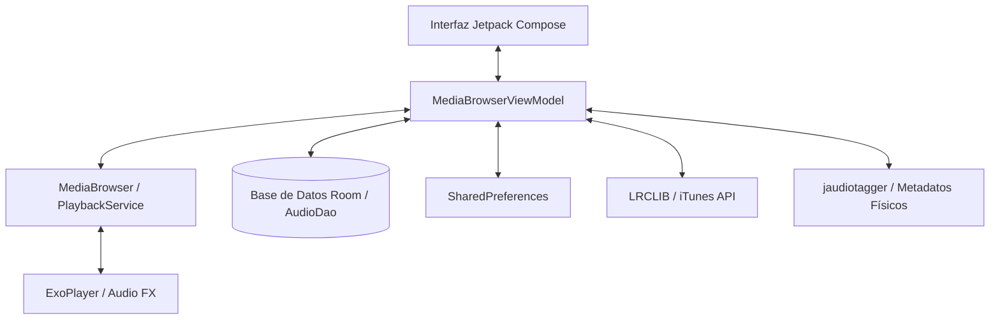

# Contexto del Proyecto: KevMusicPlayer

Este documento proporciona una descripción detallada del estado actual, la arquitectura técnica, las características implementadas y las pautas de desarrollo de **KevMusicPlayer**, un reproductor de música premium optimizado para dispositivos Android.

---

## 1. Arquitectura General y Flujo de Datos

KevMusicPlayer utiliza un patrón de diseño **MVVM (Model-View-ViewModel)** complementado con componentes modernos de Android: **Jetpack Compose** para la interfaz de usuario, **Room** para persistencia local de la biblioteca, y **AndroidX Media3 (ExoPlayer)** para la lógica de reproducción de audio y servicios en segundo plano.


```mermaid
graph TD
    UI[Interfaz Jetpack Compose] <--> VM[MediaBrowserViewModel]
    VM <--> MS[MediaBrowser / PlaybackService]
    MS <--> EP[ExoPlayer / Audio FX]
    VM <--> DB[(Base de Datos Room / AudioDao)]
    VM <--> Prefs[SharedPreferences]
    VM <--> Net[LRCLIB / iTunes API]
    VM <--> Tag[jaudiotagger / Metadatos Físicos]
```

### Capas del Proyecto:
- **Capa de Presentación (UI)**: Construida enteramente con Jetpack Compose. Admite una navegación reactiva adaptativa (List-Detail), temas visuales dinámicos (incluyendo un tema Cyberpunk, Oscuro premium y Monocromo a 120Hz reales), ecualizador visual interactivo y letras sincronizadas con microanimaciones.
- **Capa de Lógica de Negocio (ViewModel)**: `MediaBrowserViewModel` centraliza el estado de la UI (pantalla actual, canciones, playlists, búsqueda, etc.) y se comunica con el servicio de reproducción mediante el cliente `MediaBrowser` de Media3.
- **Capa de Servicios**: `PlaybackService` extiende `MediaLibraryService` de Media3, controlando una instancia interna de `ExoPlayer` aislada del ciclo de vida de la UI. Gestiona el audio focus, eventos bluetooth, efectos físicos y el widget del reproductor.
- **Capa de Persistencia**: Base de datos **Room** (`AppDatabase`) para almacenar el catálogo escaneado y cachear letras/ReplayGain/estadísticas. **SharedPreferences** almacena configuraciones generales (`settings_prefs`), la sesión activa del reproductor (`playback_prefs`) y la ecualización (`equalizer_prefs`).

---

## 2. Componentes y Subsistemas Clave

### A. Escaneo de Medios y Caché (`AudioScanner` & `AudioDao`)
- **Escaneo Inteligente:** `AudioScanner` realiza una consulta a `MediaStore.Audio.Media.EXTERNAL_CONTENT_URI`. 
- **Filtros de Duración:** Se omiten archivos menores de 5 segundos para evitar tonos de notificación o grabaciones de voz cortas.
- **Optimización de Lectura:** Para evitar lentitud en el escaneo al abrir la aplicación, el `AudioScanner` cruza los datos con la base de datos Room (`existingFiles`) para recuperar de forma instantánea el estado de `ReplayGain` y letras ya procesados.
- **Sincronización Inteligente de Archivos (v1.5.0):** Incorpora la comparación de la marca de tiempo de modificación física (`dateModified`). Si el archivo en disco no ha cambiado, Room conserva los metadatos locales y letras editadas por el usuario. Si el archivo cambió o es nuevo, lee directamente sus etiquetas físicas utilizando `jaudiotagger` en hilos de fondo (`Dispatchers.IO`), evitando retrasos o datos obsoletos de `MediaStore`.
- **Filtro de Carpeta de Música Activa:** Si el usuario ha seleccionado un directorio de música específico (`music_folder_path`), el escaneo filtra dinámicamente y descarta cualquier archivo de audio fuera de esa ruta antes de escribir en SQLite, previniendo que aparezcan archivos ajenos (como audios de WhatsApp) en el reproductor.
- **Exclusión de Carpetas:** Permite a los usuarios seleccionar directorios específicos de su almacenamiento local para ignorarlos de la biblioteca musical de manera persistente.
- **Sincronización en Inicio:** El método `scanFiles()` realiza un `join()` en la tarea de carga de base de datos inicial (`initialDbLoadJob`) para evitar condiciones de carrera (race conditions) en el inicio en frío de la app, previniendo que escaneos rápidos automáticos borren la caché local existente al asumir que la base de datos está vacía.

### B. Servicio de Reproducción y Audio FX (`PlaybackService`)
- **Estabilidad en Segundo Plano:** Mantiene un `WakeLock` parcial durante la reproducción activa para evitar suspensiones del sistema.
- **Control de Auriculares / Ruido:** Implementa `.setHandleAudioBecomingNoisy(true)` para pausar automáticamente la reproducción al desconectar auriculares.
- **Ecualizador de Audio Físico:** Configura efectos de hardware nativos sobre el `audioSessionId` activo de ExoPlayer:
  - *Equalizer:* Ecualizador paramétrico de 5 bandas.
  - *Bass Boost:* Amplificación de bajas frecuencias ajustable.
  - *Virtualizer:* Efecto de sonido envolvente espacial.
  - *LoudnessEnhancer:* Normalizador de volumen por hardware.
- **Normalización ReplayGain:** Lee de forma perezosa (lazy) las etiquetas físicas (`REPLAYGAIN_TRACK_GAIN`, `REPLAYGAIN_ALBUM_GAIN`) de los archivos de audio en un hilo de fondo (`Dispatchers.IO`), calcula la escala y ajusta el volumen del canal de `ExoPlayer` de manera dinámica.
- **Fundido Cruzado (Crossfade):** Transición suave por software que desvanece de manera gradual el volumen (Fade Out / Fade In) al cambiar de pista de forma manual o automática.
- **Modo Aleatorio Verdadero:** Los controles de reproducción aleatoria de la biblioteca eligen un primer tema al azar y activan `player.shuffleModeEnabled = true` en el reproductor en lugar de pasar una cola pre-mezclada estática. Esto sincroniza la interfaz del reproductor (marcando el botón aleatorio como activo) y activa el orden de mezcla nativo de ExoPlayer.
- **Navegación al Artista desde el Reproductor (v1.5.0):** Al presionar el nombre del artista en el reproductor principal, se ejecuta la acción `onNavigateToArtist` y se cierra el reproductor (`onBack()`), redirigiendo inmediatamente al usuario al detalle de dicho artista en la biblioteca.
- **Menú de Opciones Traducido (v1.5.0):** El menú de 3 puntos del reproductor ofrece traducción en caliente al español para todos sus elementos (Información técnica de audio, Compartir archivo de audio, Ir al artista, Ir al álbum, Editar metadatos, Eliminar pista).
- **Recuperación Automática de Errores en Cola (v1.5.1):** Si el motor de audio se topa con una pista ilegible, dañada o borrada, se captura el error mediante `onPlayerError`. El sistema muestra un mensaje emergente (Toast) detallando el fallo e intenta saltar automáticamente a la siguiente pista de la cola, preparando (`prepare()`) e iniciando la reproducción de la nueva pista. Los controles de reproducción (Play/Pause, Siguiente, Anterior) tienen detección del estado `STATE_IDLE` de ExoPlayer, auto-preparando y forzando la reanudación si el usuario intenta interactuar tras un fallo.
- **Guardado de Estado e Integridad en Reconexión (v1.5.2):** Para garantizar una reproducción en segundo plano robusta, el servicio `PlaybackService` guarda su estado (`playback_prefs`) de forma automática en segundo plano ante transiciones de pista, cambios de reproducción/pausa, saltos de posición y al destruirse. Asimismo, el `MediaBrowserViewModel` incorpora validaciones estrictas para evitar que la reconexión inicial del cliente sobrescriba la sesión activa de reproducción si esta ya se encuentra iniciada en el servicio.
- **Ciclo de Vida de Servicio Iniciado (v1.5.2):** Para evitar que el sistema destruya la reproducción en segundo plano cuando la actividad unbindea el cliente (en `ON_STOP` al minimizar la app), se inicia el servicio explícitamente usando `startService()` en `connect()` y `playFile()`. Asimismo, `onStartCommand()` en `PlaybackService` retorna `START_STICKY`, lo que obliga al sistema operativo a intentar recrear el servicio y recuperar el reproductor si el proceso es destruido por presiones de memoria del sistema.


### C. Sistema de Playlists Inteligentes (Smart Playlists)
A diferencia de las listas manuales ordinarias, las *Smart Playlists* son dinámicas y se evalúan en tiempo de ejecución a partir de reglas almacenadas en formato JSON:
- **Modelo de Reglas:** Utiliza nodos lógicos estructurados (`SmartRuleNode`) que pueden ser nodos de condición simple o grupos condicionales con operadores lógicos (`AND`, `OR`).
- **Parámetros Soportados:** Filtros de título, artista, álbum, género, año, duración, contador de reproducciones, fecha de última reproducción y fecha de adición al dispositivo.
- **Operadores de Comparación:** Equals, Contains, StartsWith, EndsWith, GreaterThan, LessThan.

### D. Letras Sincronizadas y Traducción (`LyricsRepository`)
- **Descargas LRC:** Conectividad con la API pública de **LrcLib** para buscar canciones por texto de metadatos (`Artist + Title`). Prioriza letras con marcas de tiempo sincronizadas.
- **Procesador LRC:** Parser integrado que decodifica cadenas de texto en formato estandarizado `[mm:ss.xx]` a marcas de tiempo de milisegundos (`LyricLine`).
- **Traducciones Locales y Auto-Traducción:** Soporte integrado para almacenar traducciones personalizadas mapeadas a cada marca de tiempo mediante serialización JSON. Cuenta con un sistema unificado y automático que comprueba la canción en reproducción y traduce de manera automática al idioma del sistema las letras descargadas usando APIs de traducción con fallbacks locales.
- **Transición Fluida de Letras (v1.5.0):** El cambio entre el modo carátula y el modo letras en el reproductor se realiza mediante un `AnimatedContent` de Jetpack Compose con animaciones de desvanecimiento cruzado (`fadeIn`/`fadeOut`) y escala suave (`scaleIn`/`scaleOut`) que duran entre 300 y 400ms, proporcionando una transición premium.

### E1. Panel de Estadísticas y Resumen (`MusicInsightsScreen`)
- **Visualización de Resumen de Biblioteca:** Integra el diálogo modal `MusicInsightsScreen` que calcula y presenta estadísticas en tiempo real de la biblioteca, tales como total de canciones, tiempo total de reproducción acumulado, las 5 canciones más reproducidas, distribución de géneros más escuchados, y un botón para compartir el resumen en redes. Se abre mediante un acceso rápido con icono de estadísticas en la cabecera de la biblioteca.
- **Correcciones de Color en Tema Oscuro:** Se resolvieron problemas de visibilidad de texto donde los nombres de canciones, artistas y textos de distribución de tiempo se mostraban en negro e ilegibles al usar temas oscuros (Cyberpunk, Obsidian, etc.), envolviendo la pantalla en un contenedor `Surface` y aplicando colores explícitos del tema.
- **Compartir Resumen como Imagen:** El botón de compartir ahora captura visualmente el contenedor del resumen musical mediante `GraphicsLayer` y Compose 1.7, guardándolo como un archivo PNG en la caché y compartiéndolo a través del `FileProvider` con la marca de agua "KevMusicPlayer" y un fallback automático de texto si ocurre algún error.

### E. Editor de Metadatos y Escritura Física
- **Integración jaudiotagger:** Configurado en "modo Android" (`TagOptionSingleton.getInstance().setAndroid(true)`) para manejar la edición de metadatos de audio en el almacenamiento local.
- **Escritura mediante URI en Android R+ (Scoped Storage):**
  1. Copia el archivo físico a un archivo temporal (`.tmp`).
  2. Escribe los metadatos y la portada (`AndroidArtwork`) al archivo temporal usando jaudiotagger.
  3. Reemplaza el archivo original mediante escritura directa en su ruta absoluta.
  4. En caso de fallo por restricciones de Scoped Storage, utiliza un fallback con `ContentResolver` y modo de escritura-truncado (`rwt`).
  5. Notifica al sistema operativo para re-escanear el archivo a través de `MediaScannerConnection`.
- **Actualización en Caliente del Reproductor:** Al completar la edición física de metadatos, la app busca el identificador de la canción en la cola de reproducción del reproductor Media3 y la reemplaza en caliente (`browser.replaceMediaItem`), forzando la actualización instantánea de la UI y de la notificación del sistema sin interrumpir la reproducción actual de música.

### F. Mecanismo de Respaldo y Restauración (Backup & Restore)
- **Estructura JSON y Estadísticas (v1.5.0):** Exporta en un archivo JSON toda la información del reproductor: listas manuales e inteligentes, ecualización, preferencias de usuario y caché de letras. Ahora incluye opcionalmente el nodo `"library_songs"`, que almacena los contadores de reproducción (`playCount`), fecha de última reproducción (`lastPlayed`), `replayGain` y cambios locales de metadatos de cada canción en la biblioteca.
- **Mapeo Dinámico de Restauración (v1.5.0):** Al restaurar en un dispositivo diferente (donde los IDs de MediaStore de los archivos son distintos), el sistema compara metadatos de coincidencia (título, artista y duración) para asociar el historial y estadísticas al nuevo ID correspondiente, manteniendo intactas las listas de reproducción y las estadísticas del reproductor.
- **Destino Vinculado Directo (Raíz de Música):** Si la opción "Utilizar la misma carpeta" está activada, el archivo `kev_music_player_backup.json` se almacena y busca directamente en la raíz de la carpeta de música específica seleccionada por el usuario (ej. `Music/kev_music_player_backup.json`), evitando la creación de subcarpetas adicionales redundantes.
- **Limpieza de Sesiones Zombie:** Durante la restauración, es crítico evitar colisiones de estado en el reproductor. La función `importBackup` realiza:
  1. Detención inmediata del `PlaybackService`.
  2. Borrado completo de las preferencias de sesión del player (`playback_prefs`) que guarden rutas o índices obsoletos.
  3. Cierre y re-conexión limpia del cliente `MediaBrowser` usando `viewModel.connect()` reactivamente sin forzar una recreación de la actividad (`Activity.recreate()`).

### G. Buscador y Eliminador de Música Duplicada
- **Algoritmo de Identificación Bifásico:**
  - *Fase 1 (Sufijos del mismo directorio):* Escanea carpetas locales y agrupa canciones descartando sufijos como `(1)`, `(2)`, `_1` y `- Copia` de sus nombres de archivos físicos para detectar clones redundantes.
  - *Fase 2 (Metadatos e igual duración):* Para canciones en distintos directorios, las asocia por coincidencia de título y artista, acotando la búsqueda a duraciones que no difieran en más de 3 segundos para evitar falsos positivos.
  - *Conservación Inteligente:* El sistema determina de forma autónoma el archivo "original" para preservar, priorizando la ausencia de sufijos numéricos, la fecha de creación más antigua en el dispositivo, y la ruta física más corta.
- **Borrado Masivo y Sincronizado (`deleteSongs`):**
  - Ejecuta la eliminación física (`File.delete()`) en hilos IO (`Dispatchers.IO`) para evitar bloqueos del hilo de interfaz (ANRs).
  - Remueve los archivos eliminados del `ContentResolver` de Android y los borra de la caché de la base de datos Room.
  - Se sincroniza activamente con ExoPlayer y las colas de reproducción para detener o avanzar la reproducción si la canción que está sonando ha sido marcada para borrado.

### H. Sistema de Telemetría y Registro de Errores
- **`TelemetryLogger`**:
  - Mapea de manera local errores críticos de inicialización y reproducción de `PlaybackService`, excepciones de codificadores/decriptores de ExoPlayer (`onPlayerError`), y fallos de inicialización del ecualizador/audio effects nativos de Android.
  - Captura fallos de red y de parseo de JSON en las APIs de traducción de letras, errores de E/S física o base de datos en el cálculo de ReplayGain, excepciones críticas al importar o exportar copias de seguridad de la aplicación, fallos al inicializar o liberar la conexión de `MediaBrowser`, y errores en el parseo de directorios excluidos o de carga inicial de SQLite en Room.
  - **Manejo Global de Corrutinas:** Proporciona un `CoroutineExceptionHandler` integrado que captura y registra de forma centralizada cualquier excepción no controlada en hilos o ámbitos asíncronos (como el de `PlaybackService`).
  - **API sin Contexto:** Cuenta con sobrecargas de registro estáticas que infieren el contexto global de la aplicación (`KevMusicPlayerApplication.instance`), lo que facilita la instrumentación limpia del código desde clases utilitarias o repositorios.
  - **Filtros de Logs de Diagnóstico:** Las entradas normales de tipo `[INFO]` (logs rutinarios de eventos) se limitan al Logcat de Android y no se escriben en el archivo local `telemetry_errors.log`, reservando el archivo persistente únicamente para errores, advertencias y anomalías reales.
  - **Monitoreo del Renderizador de Audio:** Implementa un `AnalyticsListener` en `PlaybackService` para capturar y registrar anomalías graves en el pipeline de renderizado y decodificación de audio (`onAudioSinkError`, `onAudioCodecError`, y `onAudioUnderrun` de larga duración) directo al registro de telemetría de errores.
  - Almacena de forma persistente las trazas de error con marcas de tiempo en el archivo `telemetry_errors.log` dentro del directorio de almacenamiento privado de la aplicación (`filesDir`), si el usuario lo habilita en la configuración.
  - Ofrece una interfaz de usuario integrada para visualizar los logs en tiempo real, vaciar el registro y copiar el volcado de errores formateados al portapapeles para su fácil diagnóstico y resolución por parte del equipo de soporte.

### I. Automatización de Compilación y Lanzamientos (CI/CD)
- **GitHub Actions Workflow (`release.yml`):**
  - Compila automáticamente el APK de producción firmado de release ante la subida de cualquier etiqueta de versión (`v*`) o mediante ejecución manual (`workflow_dispatch`).
  - Configura Java 17, maneja caché automático de dependencias y empaquetadores de Gradle, y publica la release automáticamente en el repositorio asociando el APK renombrado.

### J. Firma Compartida de Producción/Lanzamiento (Keystore)
- **Firma Unificada (`shared.keystore`):**
  - Para evitar conflictos de instalación y errores de "Firma de paquete incorrecta" al actualizar la app de forma cruzada (instalando un APK de CI/CD sobre uno compilado localmente), se almacena un keystore compartido (`app/shared.keystore`) en el repositorio.
  - El archivo `app/build.gradle.kts` define el bloque `signingConfigs` apuntando a este almacén compartido con contraseñas fijas, garantizando firmas criptográficas 100% idénticas en cualquier compilación.

### K. Sistema de Actualización Automática Integrado (`AppUpdater`)
- **Consulta de Versión en Arranque:** Cada vez que se abre la aplicación, realiza una consulta en segundo plano a la API pública de GitHub (`/releases/latest`) para comprobar si existe una versión (`versionName`) superior a la actualmente instalada.
- **Descarga Directa con Progreso:** Si se detecta una nueva versión, muestra un diálogo de confirmación MD3 con el changelog de novedades. Si el usuario acepta, descarga el APK directamente en un hilo de fondo (`Dispatchers.IO`) mostrando una barra de progreso en la UI.
- **Lanzador del Instalador:** Guarda el archivo temporalmente en la caché de la aplicación y ejecuta la instalación del APK compartiéndolo mediante `FileProvider` con los permisos necesarios, permitiendo al usuario actualizar la aplicación sin desinstalarla.

### L. Sistema de Imágenes de Artistas Automático (`ArtistImageHelper`)
- **Descarga de Retratos de Artistas:** Al renderizar la lista de artistas en la biblioteca o en el resumen musical, el componente `ArtistImage` comprueba de forma asíncrona si existe una foto de perfil del artista guardada localmente.
- **Integración con Deezer API:** Si el retrato no existe localmente, realiza una petición en segundo plano (`Dispatchers.IO`) a la API pública de Deezer, descarga el retrato en alta resolución y lo almacena localmente en formato JPEG en el directorio privado de la aplicación (`artist_images/`).
- **Control de Peticiones Duplicadas:** Utiliza cachés en memoria para evitar llamadas redundantes de descarga a la red para artistas que ya se están descargando o cuya búsqueda ha fallado en la sesión actual.
- **Renderizado Reactivo y Fallbacks:** El componente se integra de manera transparente en la interfaz de Jetpack Compose, recargando reactivamente la imagen en cuanto se completa la descarga y cayendo al diseño de gradiente y avatar estándar como fallback.
- **Cambio de Imagen Manual (v1.5.0):** Se añadió soporte para que el usuario elija manualmente un archivo de carátula de artista desde su almacenamiento usando un selector de archivos (`GetContent()`).

---

## 3. Esquema y Definición de Datos (Room Database)

La tabla `audio_files` actúa como el repositorio centralizado de la aplicación.
La base de datos actual se define en **Versión 9** (`AppDatabase.kt`) e implementa migración destructiva automática.

```kotlin
@Serializable
@Entity(tableName = "audio_files")
data class AudioFile(
    @PrimaryKey val id: Long,
    val title: String,
    val artist: String,
    val album: String,
    val genre: String = "Unknown Genre",
    val duration: Long,
    val uriString: String,
    val folderPath: String = "Internal Storage",
    val folderName: String = "Root",
    val lyrics: String? = null,
    val translatedLyrics: String? = null,
    val playCount: Int = 0,
    val dateAdded: Long = 0L,
    val lastPlayed: Long = 0L,
    val replayGain: Float? = null,
    val year: String = "",
    val dateModified: Long = 0L,
    val track: Int = 0
)
```

---

## 4. Consideraciones Técnicas y de Rendimiento

1. **Prevención de ANR (App Not Responding):** 
   - Todas las llamadas al editor de etiquetas de jaudiotagger, lecturas de archivos físicos y consultas SQL masivas deben ejecutarse explícitamente sobre el despachador de entrada/salida (`Dispatchers.IO`).
   - El escaneo inicial de `AudioScanner` realiza cargas diferidas (lazy loads) de `ReplayGain` durante la reproducción, reduciendo drásticamente el uso de recursos al iniciar la aplicación.
   - Para evitar la contención del hilo principal y problemas de ANR durante el arranque en frío (cold-start), la conexión del `MediaBrowser` y el inicio de escaneo de archivos están diferidos hasta que finaliza el flujo de bienvenida (`OnboardingFlow`).
   - Se han eliminado las llamadas disruptivas a `Activity.recreate()` al restaurar copias de seguridad u omitir/configurar temas en el Onboarding, sustituyéndolas por recomposiciones puramente reactivas guiadas por estados de Compose.
   - **Caché de Estadísticas de Biblioteca:** Para evitar la carga lenta y el molesto parpadeo de "0 canciones" al abrir la configuración de la biblioteca, la información de total de canciones y espacio en disco se almacena en caché local (`SharedPreferences`) y se actualiza asíncronamente en segundo plano.
2. **Límites de Comunicación IPC:**
   - Para evitar excepciones `TransactionTooLargeException` al pasar listas extensas de reproducción mediante IPC a Media3, se limita la cola interna a un máximo de **1500 canciones** en memoria y se utiliza paginación (`getAudioFilesPaged`) para búsquedas en la UI.
3. **Consistencia de Portadas de Álbum (Covers):**
   - Las carátulas de listas de reproducción manuales son persistidas en el directorio de caché de la aplicación y mapeadas dinámicamente en el ViewModel, evitando corrupciones en las referencias a almacenamiento externo.
4. **Optimización de Memoria y Recomposiciones en Compose (`derivedStateOf`):**
   - Se removió la creación repetida de listas temporales (`.toList()`) en las claves de bloques `remember` de alto rendimiento (búsquedas, listados principales, pager y ordenamientos).
   - Se adoptaron estructuras `derivedStateOf` con lectura directa de estado (`.value` o delegación `by`). Compose realiza un seguimiento de dependencias reactivas y solo re-calcula las operaciones pesadas (filtrado, ordenación, agrupamientos y búsquedas) si el contenido de la lista original o los filtros cambian realmente, disminuyendo la latencia de fotogramas durante scrolls a 120Hz reales.
5. **Caché Optimizado de Carátulas (v1.5.2):**
   - Para eliminar parpadeos de color y retrasos al cambiar entre canciones en el reproductor, la caché en memoria `albumArtCache` se migró de almacenar `ByteArray` a almacenar objetos `android.graphics.Bitmap` ya decodificados.
   - Las imágenes se decodifican de forma asíncrona y se re-muestrean (downsampling) a un tamaño máximo de 500x500 píxeles, lo que reduce drásticamente el consumo de RAM (evitando fallos de memoria OOM) mientras garantiza que las carátulas se dibujen instantáneamente en el primer frame de recomposición.
6. **Prevención de Excepciones en MediaMetadataRetriever (v1.5.2):**
   - Al extraer la carátula para actualizar el widget de la pantalla de inicio, el uso directo de `retriever.setDataSource(Context, Uri)` lanzaba excepciones `RuntimeException (status 0x80000000 / 0xFFFFFFEA)` en segundo plano. Esto se debe a que el proceso nativo del servidor de medios no posee permisos para resolver URIs de contenido de la aplicación.
   - Se solucionó abriendo un `ParcelFileDescriptor` a través de `contentResolver.openFileDescriptor(uri, "r")` dentro de la app y pasándole el descriptor crudo (`fileDescriptor`) al retriever, evadiendo las restricciones de permisos.

7. **Precarga de Carátulas en Segundo Plano (v1.5.3):**
   - Para eliminar por completo el parpadeo negro/color y el retraso en la carga de la carátula al cambiar de canción, se implementó un hilo de precarga en segundo plano (`preloadUpcomingArtwork`) en `MediaBrowserViewModel`.
   - Cuando ocurre una transición de canción (`onMediaItemTransition`), se leen las próximas $N$ canciones de la cola (donde $N$ es configurable por el usuario: desactivado, 3, 5 o 10 canciones) y se pre-decodifican asíncronamente en `Dispatchers.IO` dentro de la caché global `albumArtCache`.
   - En la interfaz del reproductor (`PlayerScreen`), si el `Bitmap` precargado ya está disponible en la caché, se dibuja de forma instantánea utilizando el componente nativo `Image` de Jetpack Compose en lugar del pipeline asíncrono de Coil (`SubcomposeAsyncImage`), logrando una transición 100% limpia y sin parpadeos visibles.

8. **Categoría de Rendimiento en Ajustes y Nuevos Controles de RAM/Resolución (v1.5.3):**
   - Se introdujo una pestaña dedicada de "Rendimiento" en la configuración para centralizar controles de optimización (tasa de refresco, modo sin animaciones, precarga).
   - Se añadió la opción **Capacidad de Caché (RAM)** para configurar dinámicamente el tamaño máximo de `albumArtCache` (50, 150 o 300 carátulas en RAM) llamando a `LruCache.resize()`.
   - Se añadió la opción **Calidad de Carátulas (Resolución)** para configurar el factor de downsampling (250p, 500p u 800p) de las carátulas decodificadas, reduciendo significativamente el consumo de memoria en dispositivos de gama baja. Al alternar este ajuste, se limpia la caché en caliente (`evictAll()`) para actualizar las imágenes mostradas de inmediato.

---

## 5. Estructura de Directorios del Código Fuente

```text
app/src/main/java/com/kevshupp/kevmusicplayer/
│
├── MainActivity.kt               # Punto de entrada, permisos, navegación e inicialización de MediaBrowser
│
├── data/                         # Capa de datos y persistencia
│   ├── AudioFile.kt              # Entidad Room para representar pistas
│   ├── AudioDao.kt               # Consultas Room
│   ├── AppDatabase.kt            # Inicializador Room DB
│   ├── AudioScanner.kt           # Lógica de escaneo del dispositivo
│   └── LyricsRepository.kt       # API de LrcLib, parser LRC e iTunes cover downloader
│
├── playback/                     # Gestión de reproducción y motor de audio
│   ├── PlaybackService.kt        # MediaLibraryService de Media3 (ExoPlayer y efectos de audio)
│   └── MediaBrowserViewModel.kt  # ViewModel principal y comunicación inter-procesos
│
├── ui/                           # Interfaz de usuario Jetpack Compose
│   ├── theme/                    # Paleta de colores, tipografías y definición de temas
│   └── screens/                  # Vistas del flujo de la aplicación
│       ├── Dialogs.kt            # Editores de metadatos, letras y creador de playlists inteligentes
│       ├── LibraryScreen.kt      # Biblioteca (Canciones, Álbumes, Artistas, Carpetas, Listas)
│       ├── LibraryComponents.kt  # Elementos visuales reutilizables de la biblioteca
│       ├── PlayerScreen.kt       # Pantalla de reproducción a pantalla completa, gestos y letras interactivos
│       ├── PlayerComponents.kt   # Componentes atómicos de la pantalla del reproductor
│       ├── SettingsScreen.kt     # Ajustes organizados por pestañas (General, Audio, Sistema, Biblioteca)
│       ├── SettingsComponents.kt # Componentes dinámicos de los ajustes y selector de carpetas
│       ├── MusicInsightsScreen.kt# Panel de estadísticas e historial de música
│       └── UniversalSearchOverlay.kt # Superposición de búsqueda universal en tiempo real
│
└── widget/                       # Widgets de pantalla de inicio (Glance)
    ├── MusicWidget.kt            # Definición visual y lógica del Widget
    └── MusicWidgetReceiver.kt    # Receptor del GlanceAppWidget
```

---

## 6. Próximos Pasos y Áreas de Mejora

- **Validación Avanzada de jaudiotagger:** Monitorear la compatibilidad de escritura física de covers en archivos `.m4a` y `.ogg` específicos de ciertos fabricantes chinos de Android que aplican restricciones agresivas a la escritura de almacenamiento p2p.
- **Optimización de Memoria en Glance:** Revisar periódicamente la carga asíncrona de carátulas para el widget con el fin de evitar picos de uso de memoria en dispositivos de gama baja.
- **Sincronización Multidispositivo:** Planificar la integración de exportación automática de copias de seguridad de forma programada a nubes personales (como Google Drive).

---

## 7. Pautas de Operación de Inteligencias Artificiales (Directivas Clave)

Este archivo (`context.md`) actúa como la memoria central y cerebro técnico de **KevMusicPlayer** para cualquier sesión de IA. Las siguientes directivas deben cumplirse estrictamente:

- **Creación de Releases:** La compilación y publicación de nuevas versiones (Releases en GitHub con tags `v*` y APKs de producción) **únicamente debe realizarse cuando el usuario lo solicite de forma explícita en el chat**. Ninguna IA o proceso automatizado debe crear releases o tags por iniciativa propia o de forma preventiva.
- **Consistencia de Firma:** Cualquier compilación local o remota de producción debe utilizar la configuración de firmas compartida `release` en Gradle, garantizando que el APK conserve la firma del keystore del repositorio y sea actualizable.
- **Conexión ADB Inalámbrica (Wi-Fi):** Para conectar el dispositivo de desarrollo físico en entornos Linux, se utiliza la función `adb_smart_connect` que gestiona una conexión híbrida (Red Local vía mDNS/Avahi + fallback a Tailscale con puerto dinámico), como se detalla en la sección [Configuración de Entorno y Herramientas](#8-configuración-de-entorno-y-herramientas).
- **Preservación del Contexto:** Al implementar nuevas funciones, optimizaciones o cambios arquitectónicos significativos, la IA debe documentarlos de forma oportuna en este archivo para guiar a futuras sesiones de trabajo.

---

## 8. Configuración de Entorno y Herramientas

### Conexión ADB Híbrida (Red Local + Tailscale)
Para facilitar la depuración inalámbrica con `adb` tanto en la red local (vía mDNS/Avahi) como de forma remota a través de **Tailscale**, se utiliza una función personalizada en el entorno de desarrollo (`~/.bashrc`).

Añadir el siguiente bloque al final de `~/.bashrc` en la máquina de desarrollo (Linux Mint):

```bash
# Función para conectar ADB automáticamente (Local con fallback a Tailscale)
adb_smart_connect() {
    # 1. Intentar por mDNS (Red Local Física)
    local target=$(avahi-browse -rtp _adb-tls-connect._tcp -t 2>/dev/null | grep ^= | cut -d';' -f8,9 --output-delimiter=: | head -n1)
    local connected=false

    if [ -n "$target" ]; then
        echo "📱 Dispositivo detectado por mDNS local: $target"
        # Separamos la IP para hacerle un ping rápido de 1 segundo
        local local_ip=$(echo "$target" | cut -d':' -f1)
        
        echo "📡 Verificando si la IP local responde..."
        if ping -c 1 -W 1 "$local_ip" >/dev/null 2>&1; then
            echo "✅ Red local disponible. Conectando..."
            adb connect "$target"
            connected=true
        else
            echo "⚠️ La IP local no responde (posiblemente estás en redes distintas o cambió de IP)."
        fi
    fi

    # 2. Si no se pudo conectar por red local, usar Tailscale
    if [ "$connected" = false ]; then
        echo "🔍 Intentando vía Tailscale con tu Moto G35 5G..."
        local ts_ip=$(tailscale status | grep -i "moto-g35-5g" | awk '{print $1}')
        
        if [ -n "$ts_ip" ]; then
            echo "🌐 IP de Tailscale encontrada: $ts_ip"
            # Nos pide el puerto dinámico que muestra el celular
            read -p "Introduce el puerto dinámico de Android (visto en pantalla): " ts_port
            if [ -n "$ts_port" ]; then
                adb connect "$ts_ip:$ts_port"
            fi
        else
            echo "❌ No se encontró el 'moto-g35-5g' en la lista de Tailscale. Revisa si la app está activa en el celular."
        fi
    fi
}
```

Uso en terminal:

```bash
source ~/.bashrc
adb_smart_connect
```

### Script Automatizado de Despliegue e Instalación (`conectar_adb.sh`)
Para agilizar el proceso de compilación, vinculación y despliegue del proyecto, se utiliza el script bash interactivo ubicado en el escritorio: [conectar_adb.sh](file:///home/kevin/Escritorio/conectar_adb.sh).
- **Características principales:**
  - **Auto-redirección de Interfaz:** Si se invoca fuera de una terminal interactiva, el script se re-lanza de forma automática dentro de una nueva ventana de `gnome-terminal`.
  - **Detección Dinámica de Dispositivos:** Escanea conexiones físicas USB y servicios de depuración inalámbrica en red local a través de mDNS/Avahi (`_adb-tls-connect._tcp` y `_adb-tls-pairing._tcp`). Si detecta un servicio de vinculación nuevo, solicita en consola el código de emparejamiento.
  - **Menú de Selección de Destinos:** Mediante listas seleccionables con barra de espacio y flechas, permite al desarrollador marcar en cuál o cuáles dispositivos conectados desea realizar la instalación simultánea.
  - **Configuración de Variables de Entorno:** Exporta las rutas globales del JDK 21 (Eclipse Adoptium) en `/home/kevin/.gradle/jdks/` y el Android SDK en `/home/kevin/android-sdk`.
  - **Bucle de Compilación Continua:** El desarrollador selecciona el proyecto (`kevmusicplayer`) y la variante (`Release` primero o `Debug` segundo), ejecutando `./gradlew installDebug` o `installRelease` correspondientemente. Al finalizar la instalación, muestra opciones rápidas para recompilar (`r`), realizar una reinstalación limpia desinstalando primero el paquete (`c`), cambiar de proyecto (`p`), o detener el demonio de ADB (`x`).
