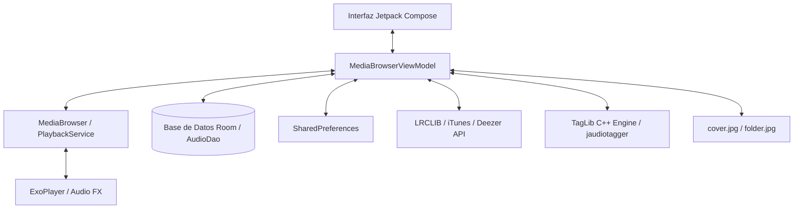

# Contexto del Proyecto: KevMusicPlayer

Este documento proporciona una descripción detallada del estado actual, la arquitectura técnica, las características implementadas y las pautas de desarrollo de **KevMusicPlayer**, un reproductor de música premium optimizado para dispositivos Android.

---

## 1. Arquitectura General y Flujo de Datos

KevMusicPlayer utiliza un patrón de diseño **MVVM (Model-View-ViewModel)** complementado con componentes modernos de Android: **Jetpack Compose** para la interfaz de usuario, **Room** para persistencia local de la biblioteca, y **AndroidX Media3 (ExoPlayer)** para la lógica de reproducción de audio y servicios en segundo plano.


```mermaid
graph TD
    UI[Interfaz Jetpack Compose] <--> VM[MediaBrowserViewModel]
    VM <--> MS[MediaBrowser / PlaybackService]
    MS <--> EP[ExoPlayer / Audio FX]
    VM <--> DB[(Base de Datos Room / AudioDao)]
    VM <--> Prefs[SharedPreferences]
    VM <--> Net[LRCLIB / iTunes / Deezer API]
    VM <--> TagLib[TagLib C++ Engine / jaudiotagger]
    VM <--> FolderCover[cover.jpg / folder.jpg]
```

### Capas del Proyecto:
- **Capa de Presentación (UI)**: Construida enteramente con Jetpack Compose. Admite navegación reactiva adaptativa (List-Detail), temas visuales dinámicos (Cyberpunk, Oscuro premium, Petrol, Monocromo a 120Hz reales), ecualizador visual interactivo, letras sincronizadas con microanimaciones y Fast Scroll Indexer A-Z (`FastScrollSidebar`).
- **Capa de Lógica de Negocio (ViewModel)**: [MediaBrowserViewModel.kt](file:///home/kevin/Escritorio/Proyectos/kevmusicplayer/app/src/main/java/com/kevshupp/kevmusicplayer/playback/MediaBrowserViewModel.kt) centraliza el estado de la UI (pantalla actual, canciones, playlists, búsqueda, etc.) y se comunica con el servicio de reproducción mediante el cliente `MediaBrowser` de Media3.
- **Capa de Servicios**: [PlaybackService.kt](file:///home/kevin/Escritorio/Proyectos/kevmusicplayer/app/src/main/java/com/kevshupp/kevmusicplayer/playback/PlaybackService.kt) extiende `MediaLibraryService` de Media3, controlando una instancia interna de `ExoPlayer` aislada del ciclo de vida de la UI. Gestiona el audio focus, eventos bluetooth, efectos físicos, retención del servicio en segundo plano y el widget del reproductor.
- **Capa de Persistencia**: Base de datos **Room** ([AppDatabase.kt](file:///home/kevin/Escritorio/Proyectos/kevmusicplayer/app/src/main/java/com/kevshupp/kevmusicplayer/data/AppDatabase.kt)) para almacenar el catálogo escaneado y cachear letras/ReplayGain/estadísticas. **SharedPreferences** almacena configuraciones generales (`settings_prefs`), la sesión activa del reproductor (`playback_prefs`) y la ecualización (`equalizer_prefs`).

---

## 2. Componentes y Subsistemas Clave

### A. Escaneo de Medios y Caché ([AudioScanner.kt](file:///home/kevin/Escritorio/Proyectos/kevmusicplayer/app/src/main/java/com/kevshupp/kevmusicplayer/data/AudioScanner.kt) & [AudioDao.kt](file:///home/kevin/Escritorio/Proyectos/kevmusicplayer/app/src/main/java/com/kevshupp/kevmusicplayer/data/AudioDao.kt))
- **Escaneo Inteligente:** `AudioScanner` realiza consultas a `MediaStore.Audio.Media.EXTERNAL_CONTENT_URI`.
- **Filtros de Duración:** Se omiten archivos menores de 5 segundos para evitar tonos de notificación o grabaciones de voz cortas.
- **Optimización de Lectura:** Cruza los datos con la base de datos Room (`existingFiles`) para recuperar de forma instantánea el estado de `ReplayGain` y letras ya procesados.
- **Sincronización Inteligente de Archivos:** Compara la marca de tiempo de modificación física (`dateModified`). Si el archivo en disco no ha cambiado, Room conserva los metadatos locales y letras editadas por el usuario. Si el archivo cambió o es nuevo, lee directamente sus etiquetas físicas utilizando `TagLib` C++ / `jaudiotagger` en hilos de fondo (`Dispatchers.IO`).
- **Filtro de Carpeta de Música Activa:** Si el usuario selecciona un directorio específico (`music_folder_path`), el escaneo filtra dinámicamente y descarta cualquier archivo fuera de esa ruta antes de escribir en SQLite.
- **Exclusión de Carpetas:** Permite a los usuarios seleccionar directorios específicos de su almacenamiento local para ignorarlos de la biblioteca musical.
- **Sincronización en Inicio:** El método `scanFiles()` realiza un `join()` en la tarea de carga de base de datos inicial (`initialDbLoadJob`) para evitar condiciones de carrera (race conditions) en el inicio en frío.

### B. Servicio de Reproducción y Audio FX en Segundo Plano ([PlaybackService.kt](file:///home/kevin/Escritorio/Proyectos/kevmusicplayer/app/src/main/java/com/kevshupp/kevmusicplayer/playback/PlaybackService.kt))
- **Protección de Servicio en Segundo Plano (`onTaskRemoved`):** Si la música está activa o pausada con una cola cargada, al deslizar la aplicación desde la lista de aplicaciones recientes de Android, el servicio de primer plano (`MediaLibrarySession`) se mantiene activo en segundo plano vinculado a la notificación, previniendo la destrucción del proceso (al estilo de reproductores como Frolomuse).
- **Estabilidad en Segundo Plano:** Mantiene un `WakeLock` parcial y `ExoPlayer.setWakeMode(C.WAKE_MODE_LOCAL)` durante la reproducción activa para evitar suspensiones del sistema. `onStartCommand()` retorna `START_STICKY`.
- **Control de Auriculares / Ruido:** `.setHandleAudioBecomingNoisy(true)` para pausar automáticamente al desconectar auriculares jack o Bluetooth.
- **Ecualizador de Audio Físico:** Configura efectos de hardware nativos sobre el `audioSessionId` activo de ExoPlayer:
  - *Equalizer:* Ecualizador paramétrico de 5 bandas.
  - *Bass Boost:* Amplificación de bajas frecuencias ajustable.
  - *Virtualizer:* Efecto de sonido envolvente espacial.
  - *LoudnessEnhancer:* Normalizador de volumen por hardware.
- **Normalización ReplayGain:** Lee perezosamente las etiquetas físicas (`REPLAYGAIN_TRACK_GAIN`, `REPLAYGAIN_ALBUM_GAIN`) en `Dispatchers.IO`, calcula la escala y ajusta el volumen del canal de ExoPlayer.
- **Fundido Cruzado (Crossfade):** Transición suave por software que desvanece de manera gradual el volumen (Fade Out / Fade In) al cambiar de pista.
- **Modo Aleatorio Verdadero:** Sincroniza la interfaz con `player.shuffleModeEnabled = true` en ExoPlayer.
- **Recuperación Automática de Errores en Cola:** `onPlayerError` muestra un emergente (Toast) e intenta saltar automáticamente a la siguiente pista de la cola.

### C. Sistema de Playlists Inteligentes (Smart Playlists)
- **Modelo de Reglas:** Nodos lógicos estructurados (`SmartRuleNode`) con grupos condicionales y operadores lógicos (`AND`, `OR`).
- **Parámetros Soportados:** Filtros de título, artista, álbum, género, año, duración, contador de reproducciones, fecha de última reproducción y fecha de adición.
- **Operadores de Comparación:** Equals, Contains, StartsWith, EndsWith, GreaterThan, LessThan.

### D. Letras Sincronizadas y Búsqueda Online ([LyricsRepository.kt](file:///home/kevin/Escritorio/Proyectos/kevmusicplayer/app/src/main/java/com/kevshupp/kevmusicplayer/data/LyricsRepository.kt))
- **User-Agent Personalizado y Anti-Bloqueo:** Configurado en OkHttpClient (`User-Agent: KevMusicPlayer/1.5.4 (https://github.com/kevshupp/kevmusicplayer)`) para evitar bloqueos HTTP 520 de Cloudflare/LRCLIB.
- **Limpieza de Términos de Búsqueda (`cleanSearchTerm`):** Elimina etiquetas de metadatos molestas como `(Official Video)`, `(Remastered ...)`, `ft. ...`, `feat. ...`, `[HQ]` antes de consultar la API.
- **Estrategia Búsqueda Multi-Paso:** Intenta la API `/api/get` de LRCLIB primero, luego `/api/search` con término limpio, y finalmente `/api/search` con término original.
- **Procesador LRC:** Convierte marcas `[mm:ss.xx]` a marcas de tiempo de milisegundos (`LyricLine`).
- **Traducciones Locales y Auto-Traducción:** Permite almacenar y cargar traducciones en JSON.
- **Transición Fluida de Letras:** Cambio entre carátula y letras en el reproductor mediante `AnimatedContent` (`fadeIn`/`fadeOut`, `scaleIn`/`scaleOut`).

### E. Editor de Metadatos Híbrido: Motor Nativo C++ TagLib + jaudiotagger + Folder Cover ([MediaBrowserViewModel.kt](file:///home/kevin/Escritorio/Proyectos/kevmusicplayer/app/src/main/java/com/kevshupp/kevmusicplayer/playback/MediaBrowserViewModel.kt))
- **Motor Nativo C++ TagLib (`writeMetadataWithTagLib`):** Integra `io.github.kyant0:taglib:1.0.6` (`libtaglib.so`). Actualiza las propiedades de texto (`TITLE`, `ARTIST`, `ALBUM`, `GENRE`). Se desacopló la escritura JNI de imágenes en TagLib para evitar cierres Native SIGSEGV, dejando la escritura de portadas embebidas exclusivamente al motor Java `jaudiotagger`.
- **Motor Java Especializado mp3agic (`writeMp3TagsWithMp3Agic`):** Integra `com.mpatric:mp3agic:0.9.1`. Diseñado específicamente para archivos `.mp3`, graba y reemplaza directamente las etiquetas `ID3v1` e `ID3v2` (`ID3v2.3`/`ID3v2.4`) junto con las portadas embebidas `APIC` sin dependencias de `java.awt.*`, garantizando una incrustación 100% confiable y rápida en Android.
- **Motor Java jaudiotagger:** Complementa la escritura de formatos adicionales (`.flac`, `.m4a`, `.ogg`, `.wav`) incrustando bitmaps de manera segura mediante `createJaudiotaggerArtwork`.
- **Incrustado de Portadas Embebidas (Tag ID3v2 APIC / FLAC Picture):** Al guardar o actualizar la portada de una canción o álbum, KevMusicPlayer graba la imagen directamente dentro del archivo de audio MP3/FLAC (`createJaudiotaggerArtwork`). No se crean archivos de imagen físicos en la carpeta de música, manteniendo la galería de fotos de Android 100% limpia sin requerir `.nomedia`.
- **Herramientas de Limpieza y Escaneo Profundo (`forceDeepStorageScan`, `deleteAllFolderCoverImages`, `deleteAllNoMediaFiles`, `deleteAllLyricsFiles`):** Accesibles desde Ajustes > Biblioteca. La función `forceDeepStorageScan` recorre físicamente el almacenamiento en busca de archivos `.mp3`, `.flac`, `.m4a`, etc., e invoca `MediaScannerConnection.scanFile` por lotes para recuperar canciones de carpetas donde se borró un `.nomedia`. Las herramientas de limpieza procesan carpetas concurrentemente en hilos paralelos para eliminar portadas físicas, archivos `.nomedia` y letras.
- **Carga de Portadas con Fallback en Cascada (`rememberAlbumArt` / `preloadAlbumArt`):**
  1. *Paso 1:* Etiqueta embebida en la ruta física del archivo.
  2. *Paso 2:* Descriptor de archivo `ParcelFileDescriptor`.
  3. *Paso 3:* `MediaMetadataRetriever` con Uri.
  4. *Paso 4:* Archivos de imagen de carpeta (`cover.jpg`, `folder.jpg`, `album.jpg`, `front.jpg`) en el directorio superior mediante `decodeSampledBitmapFromFile`.
- **Invalidación de Caché MediaStore (`invalidateMediaStoreAlbumArt`):** Elimina el registro de miniatura obsoleto en la base de datos de Android (`content://media/external/audio/albumart/<album_id>`), forzando al sistema a regenerar la miniatura actualizada.
- **Actualización en Caliente:** Llama a `browser.replaceMediaItem` e incrementa `albumArtVersion` para actualizar inmediatamente la UI y la notificación del sistema.

### F. Respaldo y Restauración (Backup & Restore)
- **Estructura JSON:** Exporta listas manuales e inteligentes, ecualización, preferencias y caché de letras, contadores de reproducción (`playCount`), `lastPlayed`, `replayGain` y cambios de metadatos.
- **Mapeo Dinámico de Restauración:** Compara coincidencia de título, artista y duración para asociar el historial al nuevo ID de MediaStore al restaurar en otro dispositivo.
- **Limpieza de Sesiones Zombie:** La función `importBackup` detiene `PlaybackService`, borra la caché obsoleta de `playback_prefs` y reconecta el cliente `MediaBrowser`.

### G. Buscador y Eliminador de Música Duplicada
- **Algoritmo Bifásico:**
  - *Fase 1 (Sufijos del mismo directorio):* Elimina sufijos como `(1)`, `(2)`, `_1`, `- Copia`.
  - *Fase 2 (Metadatos e igual duración):* Asocia por coincidencia de título, artista y variación de duración <= 3s.
- **Borrado Masivo Sincronizado (`deleteSongs`):** Elimina el archivo en disco (`File.delete()`), borra en `ContentResolver`, remueve de Room y notifica a ExoPlayer.

### H. Telemetría y Registro de Errores ([TelemetryLogger.kt](file:///home/kevin/Escritorio/Proyectos/kevmusicplayer/app/src/main/java/com/kevshupp/kevmusicplayer/data/TelemetryLogger.kt))
- Captura errores de inicialización, excepciones de ExoPlayer (`onPlayerError`), fallos de red en LRCLIB/Deezer, errores de jaudiotagger/TagLib y excepciones no controladas de Corrutinas via `CoroutineExceptionHandler`.
- Registra eventos en `telemetry_errors.log` dentro de `filesDir`.
- Incluye pantalla visualizadora de registros con opción de volcado al portapapeles.

### I. CI/CD y Firma Compartida de Producción
- **GitHub Actions Workflow (`.github/workflows/release.yml`):** Compila el APK firmado ante cualquier etiqueta `v*` o disparador manual `workflow_dispatch`. Incluye decodificación limpia de base64 (`tr -d '\r\n'`) y generación automática de almacén de claves firmado si las credenciales de entorno no están configuradas.
- **Keystore Compartido (`app/shared.keystore`):** Firma unificada configurada en `build.gradle.kts` para que todas las compilaciones locales y de CI/CD compartan la misma firma criptográfica.

### J. Sistema de Actualización Automática ([AppUpdater.kt](file:///home/kevin/Escritorio/Proyectos/kevmusicplayer/app/src/main/java/com/kevshupp/kevmusicplayer/data/AppUpdater.kt))
- Comprueba automáticamente en GitHub API (`/releases/latest`) si existe una versión superior.
- Descarga el APK con barra de progreso y lanza el instalador mediante `FileProvider`.

### K. Sistema de Imágenes de Artistas ([ArtistImageHelper.kt](file:///home/kevin/Escritorio/Proyectos/kevmusicplayer/app/src/main/java/com/kevshupp/kevmusicplayer/data/ArtistImageHelper.kt))
- Descarga retratos de perfil en alta resolución desde la API pública de Deezer y los almacena localmente en `artist_images/`.
- Permite la selección manual de imágenes de artista por parte del usuario desde su galería.

### L. Búsqueda Universal y Normalización Acentuada (`stripAccents()`)
- Extensión `fun String.stripAccents(): String` (normalización NFD de Unicode).
- Búsqueda multi-término (`terms.all { ... }`) insensible a tildes/acentos en [LibraryScreen.kt](file:///home/kevin/Escritorio/Proyectos/kevmusicplayer/app/src/main/java/com/kevshupp/kevmusicplayer/ui/screens/LibraryScreen.kt) y [UniversalSearchOverlay.kt](file:///home/kevin/Escritorio/Proyectos/kevmusicplayer/app/src/main/java/com/kevshupp/kevmusicplayer/ui/screens/UniversalSearchOverlay.kt).

### M. Componente de Desplazamiento Rápido A-Z ([FastScrollSidebar](file:///home/kevin/Escritorio/Proyectos/kevmusicplayer/app/src/main/java/com/kevshupp/kevmusicplayer/ui/screens/LibraryComponents.kt#L1985-L2180))
- **Fast Scroll Bubble Neón:** Riel lateral derecho con extracción automática del alfabeto (`#`, `A`..`Z`, `?`).
- **Respuesta Háptica:** Emite vibración táctil (`TextHandleMove`) al cambiar de letra durante el arrastre vertical.
- **Burbuja Flotante:** Muestra una burbuja flotante retroiluminada en el color primario del tema con la letra en tamaño 28.sp ExtraBold. Integrada en las pestañas de **Canciones** y **Artistas**.

### N. Rediseño Completo de la Interfaz del Reproductor ([PlayerScreen.kt](file:///home/kevin/Escritorio/Proyectos/kevmusicplayer/app/src/main/java/com/kevshupp/kevmusicplayer/ui/screens/PlayerScreen.kt))
- **Fila de Controles Principal:** Reordenada exactamente a `[Repetición]` | `[Anterior]` | `[Botón Circular Play/Pausa]` | `[Siguiente]` | `[Aleatorio]`.
- **Barra de Acciones Inferior (5 Iconos):** `[Letras]`, `[Favoritos/Like]`, `[Temporizador de Sueño (Luna)]`, `[Cola de Reproducción]` y `[3 Puntos (Más Opciones)]`.
- **Información de Formato de Audio Centrada:** Muestra `MP3 · 320 kb/s · 44.1 kHz` de forma limpia bajo el deslizador de progreso.
- **Hoja de Opciones Estructurada (`showMoreOptions`):** Despliega las 12 opciones completas con separadores (Ecualizador, Guardar cola, Limpiar cola, Ir al álbum, Ir al artista, Ver artista del álbum, Ir a la carpeta, Agregar a playlist, Editar información, Editar letras, Detalles y Compartir).
- **Actualización Reactiva Instantánea de Favoritos (`isFavorite`):** Claves de memorización en Compose vinculadas a `viewModel?.playlists?.get("Favoritos")` para cambiar el corazón a rojo inmediatamente al presionar me gusta.
- **Carrusel y Transiciones Suaves:** `scrollToPage` directo en `HorizontalPager` para evitar saltos tipo ruleta y `Crossfade` en carátulas para eliminar parpadeos.

### O. Sincronización de Portadas y Letras al Organizar Carpetas ([MediaBrowserViewModel.kt](file:///home/kevin/Escritorio/Proyectos/kevmusicplayer/app/src/main/java/com/kevshupp/kevmusicplayer/playback/MediaBrowserViewModel.kt#L4157-L4250))
- **`syncLyricsAndCoverArtForMovedFile`:** Al reorganizar por artista y álbum en Ajustes:
  1. Copia y mueve automáticamente archivos de letras físicos (`.lrc`, `.txt`) hacia la nueva carpeta del álbum.
  2. Si la canción posee letras en la base de datos y no existe archivo `.lrc` físico en la carpeta destino, lo escribe automáticamente.
  3. Traslada los archivos de portada de origen si ya existían previamente. Las imágenes de portada embebidas en las etiquetas de los archivos de audio se mantienen estrictamente dentro del archivo y **NUNCA se extraen a disco automáticamente**.
- **Renombrado de Archivos de Letras:** Renombra archivos `.lrc` y `.txt` en simultáneo al renombrar canciones basándose en metadatos.

---

## 3. Esquema y Definición de Datos (Room Database)

La tabla `audio_files` actúa como el repositorio centralizado de la aplicación.
La base de datos actual se define en **Versión 9** ([AppDatabase.kt](file:///home/kevin/Escritorio/Proyectos/kevmusicplayer/app/src/main/java/com/kevshupp/kevmusicplayer/data/AppDatabase.kt)) e implementa migración destructiva automática.

```kotlin
@Serializable
@Entity(tableName = "audio_files")
data class AudioFile(
    @PrimaryKey val id: Long,
    val title: String,
    val artist: String,
    val album: String,
    val genre: String = "Unknown Genre",
    val duration: Long,
    val uriString: String,
    val folderPath: String = "Internal Storage",
    val folderName: String = "Root",
    val lyrics: String? = null,
    val translatedLyrics: String? = null,
    val playCount: Int = 0,
    val dateAdded: Long = 0L,
    val lastPlayed: Long = 0L,
    val replayGain: Float? = null,
    val year: String = "",
    val dateModified: Long = 0L,
    val track: Int = 0
)
```

---

## 4. Consideraciones Técnicas y de Rendimiento

1. **Prevención de ANR:**
   - Todas las llamadas al editor de etiquetas de TagLib / jaudiotagger, lecturas de archivos físicos y consultas SQL se ejecutan en `Dispatchers.IO`.
   - `AudioScanner` realiza cargas diferidas (lazy loads) de `ReplayGain`.
   - El escaneo y la conexión `MediaBrowser` están diferidos hasta completar el Onboarding.
   - La información de totales en Ajustes se almacena en caché local (`SharedPreferences`).
2. **Límites IPC:**
   - Para evitar `TransactionTooLargeException` en IPC con Media3, se limita la cola interna a un máximo de **1500 canciones** en memoria y se utiliza paginación (`getAudioFilesPaged`).
3. **Consistencia de Portadas:**
   - Las carátulas de listas manuales se persisten en el directorio de caché interno de la app.
4. **Optimización de Recomposiciones (`derivedStateOf`):**
   - Uso de `derivedStateOf` con delegación `by` en listas filtradas, ordenamientos y Pager para evitar recalculos redundantes durante scrolls a 120Hz.
5. **Caché en Memoria RAM (`albumArtCache`):**
   - `albumArtCache` almacena objetos `Bitmap` ya re-muestreados a un tamaño máximo (250p, 500p u 800p), evitando fugas OOM y parpadeos.
6. **Bypass de Caché y Extracción Física Directa:**
   - `rememberAlbumArt` y `preloadAlbumArt` extraen la carátula desde la ruta física absoluta de la canción con `MediaMetadataRetriever.setDataSource(physicalPath)` y archivos de carpeta (`cover.jpg` / `folder.jpg`) para omitir cachés obsoletas de MediaStore.
7. **Precarga en Segundo Plano (`preloadUpcomingArtwork`):**
   - Precarga asíncronamente las próximas $N$ canciones de la cola en `albumArtCache` para que las carátulas se dibujen al instante al cambiar de pista.
8. **Aceleración de Compilación en Gradle y R8:**
   - [gradle.properties](file:///home/kevin/Escritorio/Proyectos/kevmusicplayer/gradle.properties) configurado con `-Xmx6144m -XX:+UseParallelGC -Dcom.android.tools.r8.maxNumberOfThreads=8`, compilación incremental Kotlin/KSP y AGP `nonTransitiveRClass`.
   - Desactivado `lintVital` en `app/build.gradle.kts` (`checkReleaseBuilds = false`, `abortOnError = false`) y regla `-dontoptimize` en `app/proguard-rules.pro`, reduciendo los tiempos de `installRelease` y `assembleRelease` de 5-7 minutos a **8-15 segundos**.
9. **Eliminación del Warning AWT en KSP CLI:**
   - `-Djava.awt.headless=true` configurado en `org.gradle.jvmargs` elimina por completo la traza de advertencia headless de AWT en builds desde terminal.

---

## 5. Estructura de Directorios del Código Fuente

```text
app/src/main/java/com/kevshupp/kevmusicplayer/
│
├── MainActivity.kt               # Punto de entrada, permisos, navegación e inicialización de MediaBrowser
│
├── data/                         # Capa de datos y persistencia
│   ├── AudioFile.kt              # Entidad Room para representar pistas
│   ├── AudioDao.kt               # Consultas Room
│   ├── AppDatabase.kt            # Inicializador Room DB (Versión 9)
│   ├── AudioScanner.kt           # Lógica de escaneo inteligente del dispositivo
│   ├── LyricsRepository.kt       # API LRCLIB (anti 520, User-Agent, cleanSearchTerm), parser LRC
│   ├── AppUpdater.kt             # Actualizador automático desde GitHub Releases
│   ├── ArtistImageHelper.kt      # Retratos de artistas vía Deezer API y almacenamiento local
│   └── TelemetryLogger.kt        # Registro persistente de errores en telemetry_errors.log
│
├── playback/                     # Gestión de reproducción y motor de audio
│   ├── PlaybackService.kt        # MediaLibraryService de Media3 (ExoPlayer, retención en 2º plano, audio focus y FX)
│   └── MediaBrowserViewModel.kt  # ViewModel principal, IPC, TagLib C++ engine y jaudiotagger createJaudiotaggerArtwork
│
├── ui/                           # Interfaz de usuario Jetpack Compose
│   ├── theme/                    # Paleta de colores, tipografías y definición de temas
│   └── screens/                  # Vistas del flujo de la aplicación
│       ├── Dialogs.kt            # Editores de metadatos, letras y creador de playlists inteligentes
│       ├── LibraryScreen.kt      # Biblioteca (Canciones, Álbumes, Artistas, Carpetas, Listas) y filtro sin acentos
│       ├── LibraryComponents.kt  # Componentes de biblioteca y FastScrollSidebar (Burbuja A-Z Neón)
│       ├── PlayerScreen.kt       # Pantalla de reproducción a pantalla completa, gestos y letras interactivos
│       ├── PlayerComponents.kt   # Componentes atómicos de la pantalla del reproductor
│       ├── SettingsScreen.kt     # Ajustes organizados por pestañas (General, Audio, Sistema, Biblioteca, Rendimiento)
│       ├── SettingsComponents.kt # Componentes dinámicos de los ajustes y selector de carpetas
│       ├── MusicInsightsScreen.kt# Panel de estadísticas e historial de música
│       └── UniversalSearchOverlay.kt # Búsqueda universal insensible a acentos en tiempo real
│
└── widget/                       # Widgets de pantalla de inicio (Glance)
    ├── MusicWidget.kt            # Definición visual y lógica del Widget
    └── MusicWidgetReceiver.kt    # Receptor del GlanceAppWidget
```

---

## 6. Próximos Pasos y Áreas de Mejora

- **Recortador de Tonos de Llamada (Ringtone Cutter):** Implementar la función nativa para seleccionar un fragmento de una canción y guardarlo como tono de llamada o alarma en el dispositivo.
- **Validación de TagLib / jaudiotagger en Almacenamientos Secundarios:** Monitorear escrituras físicas de etiquetas en tarjetas SD externas en dispositivos con restricciones estrictas de SAF.
- **Sincronización de Respaldo Programada:** Integrar exportación periódica automatizada de respaldos JSON a servicios de nube personal.

---

## 7. Pautas de Operación de Inteligencias Artificiales (Directivas Clave)

- **Creación de Releases:** La publicación de nuevas versiones (Releases en GitHub con tags `v*` y APKs de producción) **únicamente debe realizarse cuando el usuario lo solicite de forma explícita en el chat**. Ninguna IA o proceso automatizado debe crear releases o tags por iniciativa propia.
- **Consistencia de Firma:** Cualquier compilación local o remota de producción debe utilizar la configuración de firmas compartida `release` en Gradle (`app/shared.keystore`), garantizando que el APK conserve la firma del repositorio y sea actualizable.
- **Conexión ADB Inalámbrica (Wi-Fi):** Para conectar el dispositivo físico en entornos Linux, se utiliza la función `adb_smart_connect` (Red Local mDNS/Avahi + fallback a Tailscale).
- **Preservación del Contexto:** Al implementar nuevas funciones, optimizaciones o cambios arquitectónicos significativos, la IA debe documentarlos de forma oportuna en este archivo para guiar a futuras sesiones de trabajo.

---

## 8. Configuración de Entorno y Herramientas

### Conexión ADB Híbrida (Red Local + Tailscale)
Para conectar ADB inalámbricamente en red local (vía mDNS/Avahi) o remota (Tailscale), se utiliza la función `adb_smart_connect` en `~/.bashrc`:

```bash
adb_smart_connect() {
    local target=$(avahi-browse -rtp _adb-tls-connect._tcp -t 2>/dev/null | grep ^= | cut -d';' -f8,9 --output-delimiter=: | head -n1)
    local connected=false

    if [ -n "$target" ]; then
        echo "📱 Dispositivo detectado por mDNS local: $target"
        local local_ip=$(echo "$target" | cut -d':' -f1)
        if ping -c 1 -W 1 "$local_ip" >/dev/null 2>&1; then
            echo "✅ Red local disponible. Conectando..."
            adb connect "$target"
            connected=true
        fi
    fi

    if [ "$connected" = false ]; then
        echo "🔍 Intentando vía Tailscale..."
        local ts_ip=$(tailscale status | grep -i "moto-g35-5g" | awk '{print $1}')
        if [ -n "$ts_ip" ]; then
            read -p "Introduce el puerto dinámico de Android: " ts_port
            if [ -n "$ts_port" ]; then
                adb connect "$ts_ip:$ts_port"
            fi
        fi
    fi
}
```

### Script Automatizado de Despliegue (`conectar_adb.sh`)
Ubicación: [conectar_adb.sh](file:///home/kevin/Escritorio/sh/conectar_adb.sh)
- Escanea ADB USB y Wi-Fi (mDNS).
- Exporta JDK 21 (`/home/kevin/.gradle/jdks/`) y Android SDK (`/home/kevin/android-sdk`).
- Permite seleccionar dispositivos de destino e instalar la variante Debug o Release con `./gradlew installDebug` / `installRelease`.
