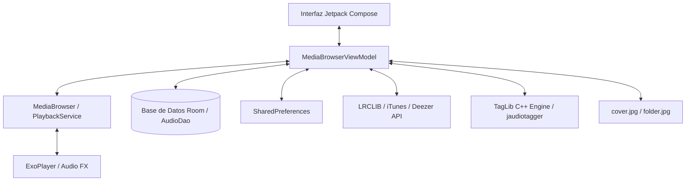

# Contexto del Proyecto: KevMusicPlayer

Este documento proporciona una descripción detallada del estado actual, la arquitectura técnica, las características implementadas y las pautas de desarrollo de **KevMusicPlayer**, un reproductor de música premium optimizado para dispositivos Android.

---

## 1. Arquitectura General y Flujo de Datos

KevMusicPlayer utiliza un patrón de diseño **MVVM (Model-View-ViewModel)** complementado con componentes modernos de Android: **Jetpack Compose** para la interfaz de usuario, **Room** para persistencia local de la biblioteca, y **AndroidX Media3 (ExoPlayer)** para la lógica de reproducción de audio y servicios en segundo plano.


```mermaid
graph TD
    UI[Interfaz Jetpack Compose] <--> VM[MediaBrowserViewModel]
    VM <--> MS[MediaBrowser / PlaybackService]
    MS <--> EP[ExoPlayer / Audio FX]
    VM <--> DB[(Base de Datos Room / AudioDao)]
    VM <--> Prefs[SharedPreferences]
    VM <--> Net[LRCLIB / iTunes / Deezer API]
    VM <--> TagLib[TagLib C++ Engine / jaudiotagger]
    VM <--> FolderCover[cover.jpg / folder.jpg]
```

### Capas del Proyecto:
- **Capa de Presentación (UI)**: Construida enteramente con Jetpack Compose. Admite navegación reactiva adaptativa (List-Detail), temas visuales dinámicos (Cyberpunk, Oscuro premium, Petrol, Monocromo a 120Hz reales), ecualizador visual interactivo, letras sincronizadas con microanimaciones y Fast Scroll Indexer A-Z (`FastScrollSidebar`).
- **Capa de Lógica de Negocio (ViewModel)**: [MediaBrowserViewModel.kt](file:///home/kevin/Escritorio/Proyectos/kevmusicplayer/app/src/main/java/com/kevshupp/kevmusicplayer/playback/MediaBrowserViewModel.kt) centraliza el estado de la UI (pantalla actual, canciones, playlists, búsqueda, etc.) y se comunica con el servicio de reproducción mediante el cliente `MediaBrowser` de Media3.
- **Capa de Servicios**: [PlaybackService.kt](file:///home/kevin/Escritorio/Proyectos/kevmusicplayer/app/src/main/java/com/kevshupp/kevmusicplayer/playback/PlaybackService.kt) extiende `MediaLibraryService` de Media3, controlando una instancia interna de `ExoPlayer` aislada del ciclo de vida de la UI. Gestiona el audio focus, eventos bluetooth, efectos físicos, retención del servicio en segundo plano y el widget del reproductor.
- **Capa de Persistencia**: Base de datos **Room** ([AppDatabase.kt](file:///home/kevin/Escritorio/Proyectos/kevmusicplayer/app/src/main/java/com/kevshupp/kevmusicplayer/data/AppDatabase.kt)) para almacenar el catálogo escaneado y cachear letras/ReplayGain/estadísticas. **SharedPreferences** almacena configuraciones generales (`settings_prefs`), la sesión activa del reproductor (`playback_prefs`) y la ecualización (`equalizer_prefs`).

---

## 2. Componentes y Subsistemas Clave

### A. Escaneo de Medios y Caché ([AudioScanner.kt](file:///home/kevin/Escritorio/Proyectos/kevmusicplayer/app/src/main/java/com/kevshupp/kevmusicplayer/data/AudioScanner.kt) & [AudioDao.kt](file:///home/kevin/Escritorio/Proyectos/kevmusicplayer/app/src/main/java/com/kevshupp/kevmusicplayer/data/AudioDao.kt))
- **Escaneo Inteligente:** `AudioScanner` realiza consultas a `MediaStore.Audio.Media.EXTERNAL_CONTENT_URI`.
- **Filtros de Duración:** Se omiten archivos menores de 5 segundos para evitar tonos de notificación o grabaciones de voz cortas.
- **Optimización de Lectura y Preservación de Estadísticas:** Cruza los datos con la base de datos Room (`existingFiles`) para recuperar de forma instantánea el estado de `ReplayGain`, letras y estadísticas (`lastPlayed`, `playCount`), evitando la pérdida de reproducciones recientes durante escaneos en segundo plano.
- **Sincronización Inteligente de Archivos:** Compara la marca de tiempo de modificación física (`dateModified`). Si el archivo en disco no ha cambiado, Room conserva los metadatos locales y letras editadas por el usuario. Si el archivo cambió o es nuevo, lee directamente sus etiquetas físicas utilizando `TagLib` C++ / `jaudiotagger` en hilos de fondo (`Dispatchers.IO`).
- **Filtro de Carpeta de Música Activa:** Si el usuario selecciona un directorio específico (`music_folder_path`), el escaneo filtra dinámicamente y descarta cualquier archivo fuera de esa ruta antes de escribir en SQLite.
- **Exclusión de Carpetas:** Permite a los usuarios seleccionar directorios específicos de su almacenamiento local para ignorarlos de la biblioteca musical.
- **Sincronización en Inicio:** El método `scanFiles()` realiza un `join()` en la tarea de carga de base de datos inicial (`initialDbLoadJob`) para evitar condiciones de carrera (race conditions) y solo muta `localAudioFiles` si detecta diferencias reales (`localAudioFiles != updatedFilesList`), previniendo parpadeos de 0 cuadros al abrir la app.

### B. Servicio de Reproducción y Audio FX en Segundo Plano ([PlaybackService.kt](file:///home/kevin/Escritorio/Proyectos/kevmusicplayer/app/src/main/java/com/kevshupp/kevmusicplayer/playback/PlaybackService.kt))
- **Protección de Servicio en Segundo Plano (`onTaskRemoved`):** Si la música está activa o pausada con una cola cargada, al deslizar la aplicación desde la lista de aplicaciones recientes de Android, el servicio de primer plano (`MediaLibrarySession`) se mantiene activo en segundo plano vinculado a la notificación, previniendo la destrucción del proceso (al estilo de reproductores como Frolomuse).
- **Estabilidad en Segundo Plano:** Mantiene un `WakeLock` parcial y `ExoPlayer.setWakeMode(C.WAKE_MODE_LOCAL)` durante la reproducción activa para evitar suspensiones del sistema. `onStartCommand()` retorna `START_STICKY`.
- **Filtro de Transiciones en Inicio:** El oyente `onMediaItemTransition` ignora la razón `MEDIA_ITEM_TRANSITION_REASON_PLAYLIST_CHANGED` durante la restauración inicial del reproductor, previniendo la alteración indebida de `lastPlayed` en el inicio en frío.
- **Control de Auriculares / Ruido y Foco de Audio:**
  - *Audio Ducking inteligente (`ignore_transient_audio_focus = true`):* Cuando otras apps (Instagram, TikTok, mensajes) solicitan el foco de audio transitorio, la música no se corta bruscamente; en su lugar, atenúa suavemente el volumen al 35% y se restablece al terminar.
  - *Pausa por Desconexión (`pause_on_headphone_unplug`):* Configuración dinámica para pausar automáticamente ante desconexión de audífonos físicos o Bluetooth (`AUDIO_BECOMING_NOISY`), evitando sorpresas por el altavoz pero protegiendo contra cortes no deseados por microdesconexiones si el usuario lo prefiere.
  - *Prioridad de llamadas:* Si entra una llamada telefónica (`isCallActive = true`), siempre se pausa la reproducción por privacidad.
- **Ecualizador de Audio Físico:** Configura efectos de hardware nativos sobre el `audioSessionId` activo de ExoPlayer:
  - *Equalizer:* Ecualizador paramétrico de 5 bandas.
  - *Bass Boost:* Amplificación de bajas frecuencias ajustable.
  - *Virtualizer:* Efecto de sonido envolvente espacial.
  - *LoudnessEnhancer:* Normalizador de volumen por hardware.
- **Normalización ReplayGain:** Lee perezosamente las etiquetas físicas (`REPLAYGAIN_TRACK_GAIN`, `REPLAYGAIN_ALBUM_GAIN`) en `Dispatchers.IO`, calcula la escala y ajusta el volumen del canal de ExoPlayer.
- **Fundido Cruzado (Crossfade):** Transición suave por software que desvanece de manera gradual el volumen (Fade Out / Fade In) al cambiar de pista.
- **Búfer Extendido para Estabilidad Bluetooth (`DefaultLoadControl`):** Configura un búfer de reproducción de 30s (min) a 90s (max) con precarga de 2s a 4s antes de iniciar el stream, tolerando retardos de I/O y latencias del stack A2DP.
- **Auto-Recuperación de Errores e Inanición de Búfer (`onAudioSinkError` / `onAudioUnderrun` / `onPlayerError`):** Si ocurre un fallo transitorio de AudioTrack o un retraso de entrega de datos en Bluetooth (`elapsedSinceLastFeedMs > bufferSizeMs + 250ms`), el servicio realiza una auto-recuperación suave instantánea (`seekTo + prepare() + play()`) para prevenir que el reproductor quede congelado en silencio.
- **Optimización Asíncrona y Desacoplada del Widget Glance (`updateWidgetState`):** La generación de la carátula `current_widget_art.png` se ejecuta 100% en `Dispatchers.IO` reutilizando directamente los bitmaps pre-escalados del caché en memoria (`albumArtCache`) o el cargador optimizado, eliminando extracciones redundantes por `MediaMetadataRetriever` y previniendo retrasos en el hilo del servicio al cambiar de canción rápidamente.
- **Enrutamiento y Efectos Seguros en Bluetooth:** `triggerAudioEffectsRecreation` reaplica la configuración sin destruir ni recrear en caliente los efectos nativos durante streaming continuo, evitando bloqueos (deadlocks) en `AudioFlinger`. `LoudnessEnhancer` utiliza una ganancia segura de `250 mB` (+2.5 dB) para prevenir clipping digital y saturación del DAC Bluetooth. `audioFocusChangeListener` conserva el nivel calculado por `ReplayGain` tras recuperar el foco.
- **Cola Aleatoria Real y Sincronización 1:1 (`shuffleAll` / `QueueManager`):**
  - *Generación de Entropía Pura:* Los botones de "Modo Aleatorio" (en Inicio, barra de búsqueda y detalle de Álbum/Artista/Playlist) utilizan `shuffleAll(list)` con semillas de alta entropía (`Random(System.nanoTime())`), barajando toda la colección antes de acotarla a los límites de memoria IPC. Esto elimina por completo el sesgo donde ciertas canciones nunca salían o se repetían patrones cíclicos.
  - *Sincronización Total de la Cola:* La cola en `ExoPlayer` almacena la lista en el orden exacto de reproducción aleatoria, ubicando la pista inicial en el índice 0. De este modo, la hoja de cola (`Playback Queue`), el carrusel de carátulas (`HorizontalPager`), los saltos de pista (siguiente/anterior) y los widgets reflejan 100% las canciones que sonarán a continuación en orden visual estricto.
  - *Auto-Scroll a Pista Activa y Toggle Dinámico:* Al abrir la cola, la vista se desplaza automáticamente a la canción en reproducción (`scrollToItem`). El botón de aleatorio en `PlayerScreen` alterna dinámicamente entre barajar las pistas restantes (`shuffleUpcomingQueue`) o restaurar el orden original (`restoreUnshuffledQueue`) sin interrumpir la pista activa.

### C. Sistema de Creación de Playlists e Interfaz Intuitiva ([LibraryComponents.kt](file:///home/kevin/Escritorio/Proyectos/kevmusicplayer/app/src/main/java/com/kevshupp/kevmusicplayer/ui/screens/LibraryComponents.kt))
- **Chips de Sugerencia de Nombre:** Permite elegir nombres predeterminados de 1 toque (`🚗 En el Auto`, `💪 Gimnasio`, `🎉 Fiesta`, `🎧 Chill`, `✈️ Viaje`, `❤️ Favoritas`, `⚡ Noche`).
- **Selector de Canciones Integrado:** Buscador en tiempo real y casillas de selección (`Checkbox`) dentro del diálogo de creación para asociar canciones iniciales en un solo paso.
- **Constructor de Reglas Inteligentes Humano:** Reemplazo total de jerga de programación (`AND`, `OR`, `GroupNode`, `>`, `<`) por lenguaje cotidiano (*"Cumplir TODAS"*, *"Cumplir AL MENOS UNA"*, *"es mayor a"*, *"es menor a"*, *"Género musical"*, *"Artista / Cantante"*).

### D. Letras Sincronizadas y Búsqueda Online ([LyricsRepository.kt](file:///home/kevin/Escritorio/Proyectos/kevmusicplayer/app/src/main/java/com/kevshupp/kevmusicplayer/data/LyricsRepository.kt))
- **User-Agent Personalizado y Anti-Bloqueo:** Configurado en OkHttpClient (`User-Agent: KevMusicPlayer/1.5.4 (https://github.com/kevshupp/kevmusicplayer)`) para evitar bloqueos HTTP 520 de Cloudflare/LRCLIB.
- **Limpieza de Términos de Búsqueda (`cleanSearchTerm`):** Elimina etiquetas de metadatos molestas como `(Official Video)`, `(Remastered ...)`, `ft. ...`, `feat. ...`, `[HQ]` antes de consultar la API.
- **Estrategia Búsqueda Multi-Paso:** Intenta la API `/api/get` de LRCLIB primero, luego `/api/search` con término limpio, y finalmente `/api/search` con término original.
- **Procesador LRC:** Convierte marcas `[mm:ss.xx]` a marcas de tiempo de milisegundos (`LyricLine`).
- **Traducciones Locales y Auto-Traducción Inteligente:** Procesamiento por lotes (`\n`) mediante Google Translate API con autodetección de idioma de origen (`sl=auto`), fallback a MyMemory, persistencia instantánea en Room DB y omisión de líneas idénticas redundantes.
- **Persistencia de Pantalla de Letras y Gestos:** `showLyrics` recuerda si la vista de letras estaba abierta entre canciones, al bloquear la pantalla o al salir de la app (configurable con `remember_lyrics_open` en Ajustes). Soporta deslizamiento horizontal (swipe) en la pantalla de letras para avanzar o retroceder de canción sin salir de las letras.

### E. Editor de Metadatos Híbrido: Motor Nativo C++ TagLib + jaudiotagger + Folder Cover ([MediaBrowserViewModel.kt](file:///home/kevin/Escritorio/Proyectos/kevmusicplayer/app/src/main/java/com/kevshupp/kevmusicplayer/playback/MediaBrowserViewModel.kt))
- **Motor Nativo C++ TagLib (`writeMetadataWithTagLib`):** Integra `io.github.kyant0:taglib:1.0.6` (`libtaglib.so`). Actualiza las propiedades de texto (`TITLE`, `ARTIST`, `ALBUM`, `GENRE`). Se desacopló la escritura JNI de imágenes en TagLib para evitar cierres Native SIGSEGV, dejando la escritura de portadas embebidas exclusivamente al motor Java `jaudiotagger`.
- **Motor Java Especializado mp3agic (`writeMp3TagsWithMp3Agic`):** Integra `com.mpatric:mp3agic:0.9.1`. Diseñado específicamente para archivos `.mp3`, graba y reemplaza directamente las etiquetas `ID3v1` e `ID3v2` (`ID3v2.3`/`ID3v2.4`) junto con las portadas embebidas `APIC` sin dependencias de `java.awt.*`, garantizando una incrustación 100% confiable y rápida en Android.
- **Motor Java jaudiotagger y Lector Seguro M4A (`SafeMp4FileReader` / `safeReadAudioFile`):** Complementa la escritura de formatos adicionales (`.flac`, `.m4a`, `.ogg`, `.wav`) incrustando bitmaps y letras de manera segura. `SafeMp4FileReader` previene excepciones de puntero nulo (`GenericAudioHeader` unboxing NPE) y átomos MP4/M4A dañados, asegurando que el guardado de letras y metadatos en pistas AAC/M4A nunca falle.
- **Incrustado de Portadas Embebidas (Tag ID3v2 APIC / FLAC Picture):** Al guardar o actualizar la portada de una canción o álbum, KevMusicPlayer graba la imagen directamente dentro del archivo de audio MP3/FLAC (`createJaudiotaggerArtwork`). No se crean archivos de imagen físicos en la carpeta de música, manteniendo la galería de fotos de Android 100% limpia sin requerir `.nomedia`.
- **Herramientas de Limpieza y Escaneo Profundo (`forceDeepStorageScan`, `deleteAllFolderCoverImages`, `deleteAllNoMediaFiles`, `deleteAllLyricsFiles`):** Accesibles desde Ajustes > Biblioteca. La función `forceDeepStorageScan` recorre físicamente el almacenamiento en busca de archivos `.mp3`, `.flac`, `.m4a`, etc., e invoca `MediaScannerConnection.scanFile` por lotes para recuperar canciones de carpetas donde se borró un `.nomedia`. Las herramientas de limpieza procesan carpetas concurrentemente en hilos paralelos para eliminar portadas físicas, archivos `.nomedia` y letras.
- **Carga de Portadas con Fallback en Cascada (`rememberAlbumArt` / `preloadAlbumArt`):**
  1. *Paso 1:* Etiqueta embebida en la ruta física del archivo.
  2. *Paso 2:* Descriptor de archivo `ParcelFileDescriptor`.
  3. *Paso 3:* `MediaMetadataRetriever` con Uri.
  4. *Paso 4:* Archivos de imagen de carpeta (`cover.jpg`, `folder.jpg`, `album.jpg`, `front.jpg`) en el directorio superior mediante `decodeSampledBitmapFromFile`.
- **Invalidación de Caché MediaStore (`invalidateMediaStoreAlbumArt`):** Elimina el registro de miniatura obsoleto en la base de datos de Android (`content://media/external/audio/albumart/<album_id>`), forzando al sistema a regenerar la miniatura actualizada.
- **Actualización en Caliente:** Llama a `browser.replaceMediaItem` e incrementa `albumArtVersion` para actualizar inmediatamente la UI y la notificación del sistema.

### F. Respaldo y Restauración Integral (Backup & Restore)
- **Estructura JSON Unificada:** Exporta el 100% del ecosistema de la app:
  1. *Base de Datos Room (`audio_files`):* Letras sincronizadas (`lyrics`), traducciones (`translatedLyrics`), estadísticas completas (`playCount`, `lastPlayed`, `dateAdded`), factor `replayGain` y etiquetas editadas por el usuario (`title`, `artist`, `album`, `genre`, `year`, `track`).
  2. *Playlists y Reglas:* Listas manuales, playlists inteligentes con su árbol de condiciones JSON y carátulas personalizadas de listas (`playlist_cover_*`).
  3. *Ecualización por Hardware:* Bandas de frecuencia, presets, Bass Boost y Virtualizer.
  4. *Preferencias Globales y Rendimiento:* Tema visual, tasa de refresco, modo sin animaciones, perfiles de rendimiento (`performance_profile`, capacidad de caché RAM/disco, resolución de carátula), carpetas excluidas/fijadas, reconexión Bluetooth y opciones de reproducción.
- **Mapeo Dinámico y Portabilidad Multi-Dispositivo:** Incluye la sección `songs_metadata` (`title`, `artist`, `album`, `duration`) para emparejar y transferir estadísticas, letras y listas a los nuevos IDs generados por `MediaStore` al restaurar en otro teléfono.
- **Limpieza de Sesiones Zombie:** La función `importBackup` detiene `PlaybackService`, purga la memoria de `playback_prefs` para prevenir colas inválidas y refresca la UI de inmediato.

### G. Buscador y Eliminador de Música Duplicada
- **Algoritmo Bifásico:**
  - *Fase 1 (Sufijos del mismo directorio):* Elimina sufijos como `(1)`, `(2)`, `_1`, `- Copia`.
  - *Fase 2 (Metadatos e igual duración):* Asocia por coincidencia de título, artista y variación de duración <= 3s.
- **Borrado Masivo Sincronizado (`deleteSongs`):** Elimina el archivo en disco (`File.delete()`), borra en `ContentResolver`, remueve de Room y notifica a ExoPlayer.

### G.2. Buscador de Canciones Cortas / Incompletas ([Dialogs.kt](file:///home/kevin/Escritorio/Proyectos/kevmusicplayer/app/src/main/java/com/kevshupp/kevmusicplayer/ui/screens/Dialogs.kt))
- **Detección Rápida de Descargas Incompletas:** Filtra canciones con duración inusualmente baja mediante umbrales dinámicos seleccionables (`< 30s`, `< 60s`, `< 90s`, `< 120s`).
- **Gestión y Re-descarga Fácil:**
  - Muestra duración exacta formateada (`mm:ss`) con badge de advertencia.
  - Botón individual para copiar el nombre de la canción y artista al portapapeles con 1 toque para buscarla y descargarla de nuevo.
  - Botón *"Copiar lista"* para exportar el listado completo de nombres/artistas de canciones cortas al portapapeles.

### G.3. Buscador y Gestor de Portadas Multi-Fuente ([CoverArtRepository.kt](file:///home/kevin/Escritorio/Proyectos/kevmusicplayer/app/src/main/java/com/kevshupp/kevmusicplayer/data/CoverArtRepository.kt) & [MissingCoverFinderDialog.kt](file:///home/kevin/Escritorio/Proyectos/kevmusicplayer/app/src/main/java/com/kevshupp/kevmusicplayer/ui/screens/dialogs/MissingCoverFinderDialog.kt))
- **Motor de Búsqueda Concurrente con Prioridad a Deezer:** Consulta en paralelo la API de Deezer (`/search/album` y `/search/track` para portadas en ultra alta resolución `1000x1000` `cover_xl`) y la API de iTunes Search (`entity=album` y `entity=song` con reescalado a `1000x1000bb`). Los resultados de Deezer se ubican **por defecto en primer lugar** de la lista y se seleccionan con máxima prioridad en descargas automáticas por lote.
- **Preferencia `preferred_cover_provider`:** Configurable en **Ajustes > Biblioteca > Proveedor preferido para descargas automáticas** (`"deezer"` [Predeterminado/Recomendado], `"itunes"`, `"both"`).
- **Estrategias Diferenciadas de Álbum vs Canción (`CoverSearchType`):**
  - *Búsqueda de Álbum:* Consulta colecciones oficiales de álbumes con `Álbum + Artista` (fallback a solo `Álbum`), eliminando singles o pistas erróneas.
  - *Búsqueda de Canción:* Consulta pistas individuales y, si la canción pertenece a un álbum, ofrece automáticamente búsqueda del arte del álbum asociado.
- **Limpieza de Términos (`cleanCoverSearchTerm`):** Elimina etiquetas de metadatos como `(Official Video)`, `[Remaster]`, `ft. ...`, prefijos numéricos (`01 - `), etc.
- **Chips de Búsqueda Rápida e Identificador de Origen:** En los diálogos de edición ([AlbumCoverEditorDialog.kt](file:///home/kevin/Escritorio/Proyectos/kevmusicplayer/app/src/main/java/com/kevshupp/kevmusicplayer/ui/screens/dialogs/AlbumCoverEditorDialog.kt), [AlbumEditorDialog.kt](file:///home/kevin/Escritorio/Proyectos/kevmusicplayer/app/src/main/java/com/kevshupp/kevmusicplayer/ui/screens/dialogs/AlbumEditorDialog.kt), [TagEditorDialog.kt](file:///home/kevin/Escritorio/Proyectos/kevmusicplayer/app/src/main/java/com/kevshupp/kevmusicplayer/ui/screens/dialogs/TagEditorDialog.kt), [MissingCoverFinderDialog.kt](file:///home/kevin/Escritorio/Proyectos/kevmusicplayer/app/src/main/java/com/kevshupp/kevmusicplayer/ui/screens/dialogs/MissingCoverFinderDialog.kt)), se presentan chips interactivos de 1 toque (`[🎵 Canción]`, `[💿 Álbum]`, `[👤 Artista]`) y badges visuales indicando el origen (`Deezer` en violeta, `iTunes` en rojo).
- **Auto-Descarga Inteligente por Lote:** Descarga en segundo plano (`Dispatchers.IO`) con reintentos y tolerancia a fallos.


### H. Telemetría y Registro de Errores ([TelemetryLogger.kt](file:///home/kevin/Escritorio/Proyectos/kevmusicplayer/app/src/main/java/com/kevshupp/kevmusicplayer/data/TelemetryLogger.kt))
- Captura errores de inicialización, excepciones de ExoPlayer (`onPlayerError`), fallos de red en LRCLIB/Deezer, errores de jaudiotagger/TagLib y excepciones no controladas de Corrutinas via `CoroutineExceptionHandler`.
- Registra eventos en `telemetry_errors.log` dentro de `filesDir`.
- Incluye pantalla visualizadora de registros con opción de volcado al portapapeles.

### I. CI/CD y Compilación Optimizada
- **Optimizador Compose Compiler (`composeCompiler { includeSourceInformation = false }`):** Desactiva la inyección de metadatos pesados de inspección en el árbol de componentes, acelerando drásticamente el rendimiento de renderizado y FPS en compilaciones Debug.
- **GitHub Actions Workflow (`.github/workflows/release.yml`):** Compila el APK firmado ante cualquier etiqueta `v*` o disparador manual `workflow_dispatch`. Incluye decodificación limpia de base64 (`tr -d '\r\n'`) y generación automática de almacén de claves firmado si las credenciales de entorno no están configuradas.
- **Keystore Compartido (`app/shared.keystore`):** Firma unificada configurada en `build.gradle.kts` para que todas las compilaciones locales y de CI/CD compartan la misma firma criptográfica.

### J. Sistema de Actualización Automática ([AppUpdater.kt](file:///home/kevin/Escritorio/Proyectos/kevmusicplayer/app/src/main/java/com/kevshupp/kevmusicplayer/data/AppUpdater.kt))
- Comprueba automáticamente en GitHub API (`/releases/latest`) si existe una versión superior.
- Descarga el APK con barra de progreso y lanza el instalador mediante `FileProvider`.

### K. Sistema de Imágenes de Artistas ([ArtistImageHelper.kt](file:///home/kevin/Escritorio/Proyectos/kevmusicplayer/app/src/main/java/com/kevshupp/kevmusicplayer/data/ArtistImageHelper.kt))
- **Limpieza de Nombres y Filtro Anti-Genéricos (`cleanArtistSearchName`):** Limpia sufijos (`feat.`, `ft.`, `&`, `x`, `vs`) y omite automáticamente nombres genéricos (`Unknown`, `Various Artists`, `Soundtrack`, `Audio`, `WhatsApp`, etc.).
- **Coincidencia Estricta en Deezer:** Valida que el nombre devuelto por la API de Deezer coincida realmente con el artista antes de descargar la imagen, evitando asignar imágenes de artistas no relacionados.
- **Gestión Directa en Detalle de Artista:** Menú desplegable en la vista de detalle del artista para elegir imagen desde la galería, buscar en línea o eliminar la foto para volver al avatar por defecto.

### L. Búsqueda Universal y Normalización Acentuada (`stripAccents()`)
- Extensión `fun String.stripAccents(): String` (normalización NFD de Unicode).
- Búsqueda multi-término (`terms.all { ... }`) insensible a tildes/acentos en [LibraryScreen.kt](file:///home/kevin/Escritorio/Proyectos/kevmusicplayer/app/src/main/java/com/kevshupp/kevmusicplayer/ui/screens/LibraryScreen.kt) y [UniversalSearchOverlay.kt](file:///home/kevin/Escritorio/Proyectos/kevmusicplayer/app/src/main/java/com/kevshupp/kevmusicplayer/ui/screens/UniversalSearchOverlay.kt).

### M. Componente de Desplazamiento Rápido A-Z ([FastScrollSidebar](file:///home/kevin/Escritorio/Proyectos/kevmusicplayer/app/src/main/java/com/kevshupp/kevmusicplayer/ui/screens/LibraryComponents.kt#L1985-L2180))
- **Fast Scroll Bubble Neón:** Riel lateral derecho con extracción automática del alfabeto (`#`, `A`..`Z`, `?`).
- **Respuesta Háptica:** Emite vibración táctil (`TextHandleMove`) al cambiar de letra durante el arrastre vertical.
- **Burbuja Flotante:** Muestra una burbuja flotante retroiluminada en el color primario del tema con la letra en tamaño 28.sp ExtraBold. Integrada en las pestañas de **Canciones** y **Artistas**.

### N. Rediseño Completo de la Interfaz del Reproductor y Cola ([PlayerScreen.kt](file:///home/kevin/Escritorio/Proyectos/kevmusicplayer/app/src/main/java/com/kevshupp/kevmusicplayer/ui/screens/PlayerScreen.kt))
- **Fila de Controles Principal:** Reordenada exactamente a `[Repetición]` | `[Anterior]` | `[Botón Circular Play/Pausa]` | `[Siguiente]` | `[Aleatorio]`.
- **Barra de Acciones Inferior (5 Iconos):** `[Letras]`, `[Favoritos/Like]`, `[Temporizador de Sueño (Luna)]`, `[Cola de Reproducción]` y `[3 Puntos (Más Opciones)]`.
- **Hoja de Opciones Estructurada (`showMoreOptions`):** Despliega las 11 opciones completas con separadores (Guardar cola, Limpiar cola, Ir al álbum, Ir al artista, Ver artista del álbum, Ir a la carpeta, Agregar a playlist, Editar información, Editar letras, Detalles y Compartir).
- **Cola de Reproducción Neo-Glow (`showQueueSheet`):** ModalBottomSheet oscuro (`0xFF0D0F18`) con cabecera premium (badge de conteo de canciones y botón limpiar estilizado), tarjetas con portada real de cada canción, borde iluminado con badge `EN REPRODUCCIÓN` para la pista activa, duración y botón para remover pistas.
- **Navegación Retorno a Inicio:** `returnToHomeScreenOnDetailBack` asegura que al abrir Favoritos o listas desde Inicio, al presionar atrás en la UI o gesto del sistema se regrese fluidamente a la pantalla de Inicio.
- **Actualización Reactiva Instantánea de Favoritos (`isFavorite`):** Claves de memorización en Compose vinculadas a `viewModel?.playlists?.get("Favoritos")` para cambiar el corazón a rojo inmediatamente al presionar me gusta.
- **Carrusel y Transiciones Suaves:** `scrollToPage` directo en `HorizontalPager` para evitar saltos tipo ruleta y `Crossfade` en carátulas para eliminar parpadeos.
- **Renderizado Limpio de Portadas (Anti Cuadro Fantasma):** Las carátulas utilizan `Box` con `.shadow(clip = true)` y `.clip(artShape)` con sombra suave negra en lugar de `Card` con elevación desmedida o halos de color primario, eliminando el artefacto visual de caja/marco descolorido alrededor de las esquinas redondeadas sobre fondos oscuros.

### O. Sincronización de Portadas y Letras al Organizar Carpetas ([MediaBrowserViewModel.kt](file:///home/kevin/Escritorio/Proyectos/kevmusicplayer/app/src/main/java/com/kevshupp/kevmusicplayer/playback/MediaBrowserViewModel.kt#L4157-L4250))
- **`syncLyricsAndCoverArtForMovedFile`:** Al reorganizar por artista y álbum en Ajustes:
  1. Copia y mueve automáticamente archivos de letras físicos (`.lrc`, `.txt`) hacia la nueva carpeta del álbum.
  2. Si la canción posee letras en la base de datos y no existe archivo `.lrc` físico en la carpeta destino, lo escribe automáticamente.
  3. Traslada los archivos de portada de origen si ya existían previamente. Las imágenes de portada embebidas en las etiquetas de los archivos de audio se mantienen estrictamente dentro del archivo y **NUNCA se extraen a disco automáticamente**.

### P. KevWrapped & Resumen Musical Interactivo ([MusicInsightsScreen.kt](file:///home/kevin/Escritorio/Proyectos/kevmusicplayer/app/src/main/java/com/kevshupp/kevmusicplayer/ui/screens/MusicInsightsScreen.kt))
- **Filtros Temporales:** Selector interactivo de período (*Todo el tiempo*, *Este año*, *Este mes*, *Últimos 30 días*).
- **Ranking Top 5:** Top Canciones (con badges de oro/plata/bronce), Top Artistas (con fotos circulares) y Top Álbumes (con portadas HD).
- **Desglose de Géneros:** Gráfico de barras de progreso con gradientes y cálculo porcentual exacto.
- **Distribución de Actividad:** Días de la semana más activos (gráfico de 7 barras verticales identificando el día pico) y distribución horaria (Madrugada, Mañana, Tarde, Noche).
- **Acciones Rápidas con 1 Toque:** Botones *"Reproducir Top"* para iniciar la cola de las canciones del ranking y *"Crear Playlist"* para guardarlas automáticamente en una lista de reproducción.
- **Generador de Póster "Wrapped Story":** Ventana modal que renderiza un póster visual en formato vertical 9:16 con la carátula del Top 1, estadísticas y logo de KevMusicPlayer, exportable y compartible como imagen PNG con 1 toque.

### Q. Modo de Visualización de Biblioteca y Optimización de Ajustes ([LibraryScreen.kt](file:///home/kevin/Escritorio/Proyectos/kevmusicplayer/app/src/main/java/com/kevshupp/kevmusicplayer/ui/screens/LibraryScreen.kt), [SettingsScreen.kt](file:///home/kevin/Escritorio/Proyectos/kevmusicplayer/app/src/main/java/com/kevshupp/kevmusicplayer/ui/screens/SettingsScreen.kt) & [LibrarySettingsSection.kt](file:///home/kevin/Escritorio/Proyectos/kevmusicplayer/app/src/main/java/com/kevshupp/kevmusicplayer/ui/screens/settings/LibrarySettingsSection.kt))
- **Preferencia `library_layout_mode`:** Configurable en **Ajustes > Biblioteca > Diseño de Biblioteca** (`"normal"` por defecto, `"compact"`).
- **Modo Normal:** Cabecera amplia "Kev Music" con subtítulo descriptivo (padding vertical 20.dp, botones de 48.dp), barra de búsqueda completa (52.dp de altura), chips de categoría con padding holgado (12.dp vertical) y tarjetas de canciones con carátula de 48.dp y padding de 12.dp.
- **Modo Compacto:**
  - *Consistencia de Botones Superiores:* Mantiene los botones de acción principales (`Recargar`, `Insights`, `Ajustes`) a 48.dp consistentes con `HomeScreen.kt` para evitar discordancias visuales al cambiar de pestaña.
  - *Buscador Integrado Anti-Recorte:* Barra de búsqueda `OutlinedTextField` optimizada con `heightIn(min = 48.dp)` y colores explícitos de texto para garantizar visualización clara de las letras al tipear.
  - *Barra de Filtros Compacta:* Chips de pestañas comprimidos a 32.dp de altura (padding vertical 4.dp).
  - *Lista de Canciones de Alta Densidad (`SongListItem` / `SongListView`):* Espaciado vertical reducido a 4.dp, padding de ítem reducido a 6.dp, carátula de 40.dp y tipografía adaptada, permitiendo visualizar significativamente más canciones simultáneamente en pantalla sin scroll innecesario.
- **Optimización de Densidad y Botones de Información en Ajustes (`SettingsInfoButton`):**
  - *Reducción de Scroll:* Se redujo el padding vertical y entre tarjetas en `SettingsScreen.kt` (horizontal 16.dp, vertical 12.dp, espaciado 14.dp) y el padding interno de tarjetas de 20.dp a 14.dp en `LibrarySettingsSection.kt`.
  - *Botón Informativo `SettingsInfoButton` (`?`):* Sustituye los largos párrafos explicativos debajo de cada botón de mantenimiento por un botón de ayuda limpio `?` que despliega un `AlertDialog` estilizado con esquinas redondeadas (24.dp), título claro de la sección y texto completo sin recortes temporales ni truncamiento, con botón "Entendido" para cerrarlo cómodamente.
  - *Botones de Acción Compactos:* Altura de botones estandarizada a 46.dp con esquinas de 16.dp, logrando una reducción del 60% en la longitud de desplazamiento vertical de Ajustes sin perder identidad visual ni información.

---

## 3. Esquema y Definición de Datos (Room Database)

La tabla `audio_files` actúa como el repositorio centralizado de la aplicación.
La base de datos actual se define en **Versión 10** ([AppDatabase.kt](file:///home/kevin/Escritorio/Proyectos/kevmusicplayer/app/src/main/java/com/kevshupp/kevmusicplayer/data/AppDatabase.kt)) e implementa migración destructiva automática.

```kotlin
@Immutable
@Serializable
@Entity(
    tableName = "audio_files",
    indices = [
        Index(value = ["artist"]),
        Index(value = ["album"]),
        Index(value = ["folderPath"]),
        Index(value = ["playCount"]),
        Index(value = ["title"]),
        Index(value = ["dateAdded"])
    ]
)
data class AudioFile(
    @PrimaryKey val id: Long,
    val title: String,
    val artist: String,
    val album: String,
    val genre: String = "Unknown Genre",
    val duration: Long,
    val uriString: String,
    val folderPath: String = "Internal Storage",
    val folderName: String = "Root",
    val lyrics: String? = null,
    val translatedLyrics: String? = null,
    val playCount: Int = 0,
    val dateAdded: Long = 0L,
    val lastPlayed: Long = 0L,
    val replayGain: Float? = null,
    val year: String = "",
    val dateModified: Long = 0L,
    val track: Int = 0
)
```

---

## 4. Consideraciones Técnicas y de Rendimiento

1. **Prevención de ANR:**
   - Todas las llamadas al editor de etiquetas de TagLib / jaudiotagger, lecturas de archivos físicos y consultas SQL se ejecutan en `Dispatchers.IO`.
   - `AudioScanner` realiza cargas diferidas (lazy loads) de `ReplayGain`.
   - El escaneo y la conexión `MediaBrowser` están diferidos hasta completar el Onboarding.
   - El cálculo del tamaño de la caché de portadas en disco se ejecuta asíncronamente en `Dispatchers.IO`.
2. **Límites IPC:**
   - Para evitar `TransactionTooLargeException` en IPC con Media3, se limita la cola interna a un máximo configurable (500, 1500 o 3000 canciones) en memoria y se utiliza paginación (`getAudioFilesPaged`).
3. **Consistencia de Portadas:**
   - Las carátulas de listas manuales se persisten en el directorio de caché interno de la app.
4. **Optimización de Recomposiciones (`derivedStateOf` & `@Immutable`):**
   - Uso de `derivedStateOf` con delegación `by` y claves de memorización precisas (`remember(audioFiles, searchQuery, sortBy)`) en listas filtradas, ordenamientos y Pager para evitar recalculos redundantes durante scrolls a 120Hz.
   - Modelo `AudioFile` anotado con `@Immutable` para habilitar *Smart Skipping* en Compose y evitar recomposiciones masivas durante la reproducción.
   - Aislamiento de ítems en `SongListItem` con gestos `combinedClickable` en lugar de interceptores táctiles pesados, logrando scrolling perfecto a 120 FPS sin bloqueos.
5. **Reciclaje Eficiente de Nodos Compose (`contentType` & `LazyRow`):**
   - Implementación de `contentType` en todos los `LazyColumn` principales (`SongListView`, `ScrollingLyricsView`, cola de reproducción en `PlayerScreen`), permitiendo a Compose reutilizar los componentes de UI reciclados sin recalcular su jerarquía en desplazamientos rápidos.
   - Virtualización horizontal en `HomeScreen` con `LazyRow` en lugar de `Row` + `horizontalScroll`.
   - `rememberAlbumArt` totalmente asíncrono y no bloqueante para el hilo principal (Main/UI thread), garantizando 120 FPS estables sin jank ni tirones.
   - Decodificación optimizada a **`Bitmap.Config.RGB_565`** en miniaturas de listas para ahorrar un **50% de memoria RAM** por cada imagen.
   - Configuración global de Coil con **`ImageLoaderFactory`** en `KevMusicPlayerApplication` utilizando **`Bitmap.Config.HARDWARE`**, `MemoryCache` dedicado (25% RAM) y `DiskCache` local para almacenar texturas directamente en la GPU.
6. **Paginación Inteligente con Jetpack Paging 3 ([AudioDao.kt](file:///home/kevin/Escritorio/Proyectos/kevmusicplayer/app/src/main/java/com/kevshupp/kevmusicplayer/data/AudioDao.kt) & [MediaBrowserViewModel.kt](file:///home/kevin/Escritorio/Proyectos/kevmusicplayer/app/src/main/java/com/kevshupp/kevmusicplayer/playback/MediaBrowserViewModel.kt)):**
   - Integración nativa de `PagingSource<Int, AudioFile>` (`getAudioFilesPagingSource()`, `searchAudioFilesPagingSource()`) y flujo `audioFilesPagingFlow` cacheado en `viewModelScope`.
   - Permite la carga perezosa bajo demanda en bloques configurables (`pageSize = 40`, `prefetchDistance = 20`, `initialLoadSize = 60`), reduciendo el consumo de memoria RAM y el tiempo de arranque.
7. **Caché LRU para Letras y Desacople de Red ([LyricsRepository.kt](file:///home/kevin/Escritorio/Proyectos/kevmusicplayer/app/src/main/java/com/kevshupp/kevmusicplayer/data/LyricsRepository.kt)):**
   - `parsedLrcCache`: Caché LRU en memoria (`LruCache<String, List<LyricLine>>(100)`) que evita volver a parsear expresiones regulares `Regex` en cada frame/recomposición del reproductor.
   - Búsqueda automática en LRCLIB con debounce suave en segundo plano, aislada del hilo de renderizado.
8. **Optimización de Conexiones HTTP (`ConnectionPool`):**
   - `LyricsRepository` y `ArtistImageHelper` utilizan pools de conexiones HTTP compartidos (`ConnectionPool(5, 5, TimeUnit.MINUTES)`) con timeouts acotados de 15s para descargas concurrentes de letras e imágenes sin saturar sockets.
9. **Loop de Fundido Cruzado (Crossfade) Inteligente:**
   - `startFadeCheckLoop` en `PlaybackService` duerme hasta 1000ms cuando la canción está lejos del punto de crossfade y se suspende por completo si `crossfade_duration == 0` o el reproductor está en pausa, consumiendo 0% de CPU innecesaria en segundo plano.
10. **Caché en Memoria RAM (`albumArtCache`) y Desacople de Widget/Notificaciones:**
    - `albumArtCache` almacena objetos `Bitmap` ya re-muestreados a un tamaño máximo (250p, 500p u 800p), con tamaño dinámicamente ajustable en caliente (`updateAlbumArtCacheSize`).
    - Generación y compresión PNG de carátulas para el widget Glance 100% aisladas en `Dispatchers.IO` dentro de `PlaybackService`.
11. **Perfiles de Rendimiento Coherentes y Conmutación Automática a Personalizado ([PerformanceSettingsSection.kt](file:///home/kevin/Escritorio/Proyectos/kevmusicplayer/app/src/main/java/com/kevshupp/kevmusicplayer/ui/screens/settings/PerformanceSettingsSection.kt)):**
    - `⚡ Máximo Rendimiento`: 120Hz, Animaciones activas, Caché RAM 300 (Alta), Precarga 5, Calidad 500p, Compresión WebP 85%, Búfer IPC 3000.
    - `⚖️ Equilibrado`: 120Hz, Animaciones activas, Caché RAM 150 (Med), Precarga 3, Calidad 500p, Compresión WebP 85%, Búfer IPC 1500.
    - `🔋 Ahorro de Batería`: 60Hz, Sin animaciones, Caché RAM 50 (Baja), Precarga Off (0), Calidad 250p, Compresión WebP 70% (Rápida), Búfer IPC 500.
    - `⚙️ Personalizado`: Conmuta automáticamente al perfil manual tan pronto como el usuario modifica cualquier control individual en pantalla.
12. **Aceleración de Compilación en Gradle y R8:**
    - [gradle.properties](file:///home/kevin/Escritorio/Proyectos/kevmusicplayer/gradle.properties) configurado con `-Xmx6144m -XX:+UseParallelGC -Dcom.android.tools.r8.maxNumberOfThreads=8`, compilación incremental Kotlin/KSP y AGP `nonTransitiveRClass`.
    - Desactivado `lintVital` en `app/build.gradle.kts` (`checkReleaseBuilds = false`, `abortOnError = false`) y regla `-dontoptimize` en `app/proguard-rules.pro`, reduciendo los tiempos de `assembleDebug` y `installRelease` a solo **8-15 segundos**.
13. **Desactivación de Auto-Backup en Manifiesto:**
    - Configurado `android:allowBackup="false"` en [AndroidManifest.xml](file:///home/kevin/Escritorio/Proyectos/kevmusicplayer/app/src/main/AndroidManifest.xml) para evitar que Google Cloud Backup restaure bases de datos obsoletas tras una reinstalación.

---

## 5. Estructura de Directorios del Código Fuente

```text
app/src/main/java/com/kevshupp/kevmusicplayer/
│
├── MainActivity.kt               # Punto de entrada, permisos, navegación e inicialización de MediaBrowser
│
├── data/                         # Capa de datos y persistencia
│   ├── AudioFile.kt              # Entidad Room para representar pistas
│   ├── AudioDao.kt               # Consultas Room ligeras y bajo demanda
│   ├── AppDatabase.kt            # Inicializador Room DB (Versión 10)
│   ├── AudioScanner.kt           # Lógica de escaneo inteligente del dispositivo
│   ├── CoverArtRepository.kt     # Búsqueda multi-fuente de portadas HD (Deezer + iTunes, álbum/canción)
│   ├── LyricsRepository.kt       # API LRCLIB (anti 520, User-Agent, cleanSearchTerm), parser LRC
│   ├── AppUpdater.kt             # Actualizador automático desde GitHub Releases
│   ├── ArtistImageHelper.kt      # Retratos de artistas vía Deezer API y almacenamiento local
│   └── TelemetryLogger.kt        # Registro persistente de errores en telemetry_errors.log
│
├── playback/                     # Gestión de reproducción y motor de audio
│   ├── PlaybackService.kt        # MediaLibraryService de Media3 (ExoPlayer, retención en 2º plano, audio focus y FX)
│   ├── MediaBrowserViewModel.kt  # ViewModel principal de reproducción e IPC
│   ├── SmartRules.kt             # Modelos de reglas JSON, ConditionNode, GroupNode y expresiones regulares
│   ├── AudioIOHelpers.kt         # Helpers de lectura/escritura física de audio, metadatos y letras .lrc exclusivas
│   └── managers/                 # Submódulos desacoplados de lógica de negocio
│       ├── PlaylistManager.kt    # Listas normales e inteligentes, reglas JSON y portadas
│       ├── IntegrityCheckerManager.kt # Verificación física paralela (16 corrutinas)
│       └── QueueManager.kt       # Gestión modular de cola de reproducción
│
├── ui/                           # Interfaz de usuario Jetpack Compose
│   ├── theme/                    # Paleta de colores, tipografías y definición de temas
│   └── screens/                  # Vistas del flujo de la aplicación
│       ├── Dialogs.kt            # Diálogos principales
│       ├── dialogs/              # Diálogos modulares desacoplados
│       │   ├── SleepTimerDialog.kt   # Temporizador de apagado
│       │   ├── SaveQueueDialog.kt    # Guardar cola activa como playlist
│       │   ├── SearchLyricsDialog.kt # Búsqueda de letras en línea
│       │   ├── DeleteSongDialog.kt   # Confirmación de borrado de canción
│       │   └── AudioSpecsDialog.kt   # Especificaciones técnicas de audio
│       ├── LibraryScreen.kt      # Biblioteca (Canciones, Álbumes, Artistas, Carpetas, Listas) y filtro sin acentos
│       ├── LibraryComponents.kt  # Componentes de biblioteca (SongListItem optimizado) y FastScrollSidebar
│       ├── PlayerScreen.kt       # Pantalla de reproducción a pantalla completa, gestos y letras interactivos
│       ├── PlayerComponents.kt   # Componentes atómicos de la pantalla del reproductor
│       ├── SettingsScreen.kt     # Ajustes organizados por pestañas
│       ├── settings/             # Submódulos desacoplados de configuración
│       │   ├── SettingsCommon.kt # Utilidades, colores y controles gráficos
│       │   ├── GeneralSettingsSection.kt     # Idioma, tema visual, ordenamiento, gestos
│       │   ├── AudioSettingsSection.kt       # Ecualizador, Bass Boost, Virtualizer, ReplayGain, Crossfade
│       │   ├── PerformanceSettingsSection.kt # Perfiles 120Hz, FPS, capacidad de caché RAM/disco alineados
│       │   ├── SystemSettingsSection.kt      # Permisos, widgets, batería, backups y restauraciones
│       │   ├── LibrarySettingsSection.kt     # Escaneo, carpetas excluidas, duplicados, integridad, letras
│       │   └── AboutSettingsSection.kt       # Versión, telemetría, actualizador y créditos
│       ├── MusicInsightsScreen.kt# Panel de estadísticas e historial de música
│       └── UniversalSearchOverlay.kt # Búsqueda universal insensible a acentos en tiempo real
│
└── widget/                       # Widgets de pantalla de inicio (Glance)
    ├── MusicWidget.kt            # Definición visual y lógica del Widget
    └── MusicWidgetReceiver.kt    # Receptor del GlanceAppWidget
```

---

## 6. Próximos Pasos y Áreas de Mejora

### A. Plan de Modularización de Archivos Extensos (> 1.500 líneas)
1. **[MediaBrowserViewModel.kt](file:///home/kevin/Escritorio/Proyectos/kevmusicplayer/app/src/main/java/com/kevshupp/kevmusicplayer/playback/MediaBrowserViewModel.kt)**:
   - *Progreso actual:* Se extrajeron `SmartRules.kt`, `AudioIOHelpers.kt`, `PlaylistManager.kt`, `IntegrityCheckerManager.kt` y `QueueManager.kt`.
   - *Pendiente:* Extraer managers restantes (`BackupManager`, `LyricsDownloadManager`, `StorageOrganizerManager`, `TagEditorManager`).
2. **[PlayerScreen.kt](file:///home/kevin/Escritorio/Proyectos/kevmusicplayer/app/src/main/java/com/kevshupp/kevmusicplayer/ui/screens/PlayerScreen.kt)**:
   - *Progreso actual:* Se extrajeron los diálogos a `ui/screens/dialogs/` (`SleepTimerDialog`, `SaveQueueDialog`, `SearchLyricsDialog`, `DeleteSongDialog`, `AudioSpecsDialog`).
   - *Pendiente:* Desacoplar hojas secundarias (`QueueBottomSheet`, `VisualizerOverlay`).
3. **[LibraryComponents.kt](file:///home/kevin/Escritorio/Proyectos/kevmusicplayer/app/src/main/java/com/kevshupp/kevmusicplayer/ui/screens/LibraryComponents.kt)** y **[LibraryScreen.kt](file:///home/kevin/Escritorio/Proyectos/kevmusicplayer/app/src/main/java/com/kevshupp/kevmusicplayer/ui/screens/LibraryScreen.kt)**:
   - *Propuesta:* Modularizar por pestañas en `ui/screens/library/` (`SongTabContent`, `AlbumTabContent`, `ArtistTabContent`, `FolderTabContent`, `PlaylistTabContent`).
4. **[LibrarySettingsSection.kt](file:///home/kevin/Escritorio/Proyectos/kevmusicplayer/app/src/main/java/com/kevshupp/kevmusicplayer/ui/screens/settings/LibrarySettingsSection.kt)**:
   - *Propuesta:* Separar herramientas de mantenimiento físico (`FileOrganizerSection`, `FolderScannerSection`, `IntegrityToolsSection`).

### B. Nuevas Funcionalidades
- **Recortador de Tonos de Llamada (Ringtone Cutter):** Implementar la función nativa para seleccionar un fragmento de una canción y guardarlo como tono de llamada o alarma en el dispositivo.
- **Validación de TagLib / jaudiotagger en Almacenamientos Secundarios:** Monitorear escrituras físicas de etiquetas en tarjetas SD externas en dispositivos con restricciones estrictas de SAF.
- **Sincronización de Respaldo Programada:** Integrar exportación periódica automatizada de respaldos JSON a servicios de nube personal.

---

## 7. Pautas de Operación de Inteligencias Artificiales (Directivas Clave)

- **Creación de Releases:** La publicación de nuevas versiones (Releases en GitHub con tags `v*` y APKs de producción) **únicamente debe realizarse cuando el usuario lo solicite de forma explícita en el chat**. Ninguna IA o proceso automatizado debe crear releases o tags por iniciativa propia.
- **Consistencia de Firma:** Cualquier compilación local o remota de producción debe utilizar la configuración de firmas compartida `release` en Gradle (`app/shared.keystore`), garantizando que el APK conserve la firma del repositorio y sea actualizable.
- **Modularidad y Tamaño de Archivos (Principio de Responsabilidad Única):** Ningún archivo de componentes o lógica debe acumular miles de líneas (evitar archivos > 1.500-2.000 líneas). Cuando una pantalla o subsistema crezca por encima de ese umbral, debe descomponerse en paquetes modulares temáticos (como se realizó con `ui/screens/settings/` o los Use Cases/Repositories). Esto garantiza compilaciones incrementales ultrarrápidas, legibilidad, prevención de conflictos git y facilidad de pruebas.
- **Conexión ADB Inalámbrica (Wi-Fi):** Para conectar el dispositivo físico en entornos Linux, se utiliza la función `adb_smart_connect` (Red Local mDNS/Avahi + fallback a Tailscale).
- **Preservación del Contexto:** Al implementar nuevas funciones, optimizaciones o cambios arquitectónicos significativos, la IA debe documentarlos de forma oportuna en este archivo para guiar a futuras sesiones de trabajo.

---

## 8. Configuración de Entorno y Herramientas

### Conexión ADB Híbrida (Red Local + Tailscale)
Para conectar ADB inalámbricamente en red local (vía mDNS/Avahi) o remota (Tailscale), se utiliza la función `adb_smart_connect` en `~/.bashrc`:

```bash
adb_smart_connect() {
    local target=$(avahi-browse -rtp _adb-tls-connect._tcp -t 2>/dev/null | grep ^= | cut -d';' -f8,9 --output-delimiter=: | head -n1)
    local connected=false

    if [ -n "$target" ]; then
        echo "📱 Dispositivo detectado por mDNS local: $target"
        local local_ip=$(echo "$target" | cut -d':' -f1)
        if ping -c 1 -W 1 "$local_ip" >/dev/null 2>&1; then
            echo "✅ Red local disponible. Conectando..."
            adb connect "$target"
            connected=true
        fi
    fi

    if [ "$connected" = false ]; then
        echo "🔍 Intentando vía Tailscale..."
        local ts_ip=$(tailscale status | grep -i "moto-g35-5g" | awk '{print $1}')
        if [ -n "$ts_ip" ]; then
            read -p "Introduce el puerto dinámico de Android: " ts_port
            if [ -n "$ts_port" ]; then
                adb connect "$ts_ip:$ts_port"
            fi
        fi
    fi
}
```

### Script Automatizado de Despliegue (`conectar_adb.sh`)
Ubicación: [conectar_adb.sh](file:///home/kevin/Escritorio/sh/conectar_adb.sh)
- Escanea ADB USB y Wi-Fi (mDNS).
- Exporta JDK 21 (`/home/kevin/.gradle/jdks/`) y Android SDK (`/home/kevin/android-sdk`).
- Permite seleccionar dispositivos de destino e instalar la variante Debug o Release con `./gradlew installDebug` / `installRelease`.

---

## 8. Novedades y Optimizaciones v1.2.28

1. **Diseño Visual de Biblioteca (Vista Moderna vs Vista Clásica):**
   - Selector en **Configuración > Biblioteca > Estilo Visual de Canciones** para alternar libremente entre la nueva vista moderna y la clásica.
   - **Vista Moderna:** Filas limpias y fluidas sin recuadros oscuros pesados (estilo Apple Music/Spotify), carátulas ampliadas a 52dp para mayor fidelidad visual, tipografía optimizada y margen derecho adaptativo (30dp) para evitar que el menú de 3 puntos colisione con la barra de letras.
   - **Vista Clásica:** Conserva las tarjetas rectangulares oscuras independientes para quienes prefieran el diseño anterior.

2. **Barra Lateral de Desplazamiento Rápido A-Z (`FastScrollSidebar`):**
   - Abecedario completo garantizado (`#` y `A`–`Z`) distribuido equitativamente mediante `Modifier.weight(1f)`, asegurando visibilidad total en cualquier resolución sin recortes al final (`X, Y, Z`).
   - Normalización inteligente de caracteres con tildes y caracteres especiales en español (`Á` $\to$ `A`, `Ñ` $\to$ `N`, números $\to$ `#`).
   - Búsqueda predictiva por proximidad (`findTargetIndex`) al tocar o deslizar.

3. **Carruseles de Inicio Edge-to-Edge ([HomeScreen.kt](file:///home/kevin/Escritorio/Proyectos/kevmusicplayer/app/src/main/java/com/kevshupp/kevmusicplayer/ui/screens/HomeScreen.kt)):**
   - Migración de `LazyRow` a ancho completo con `contentPadding = PaddingValues(horizontal = 20.dp)`, eliminando los cortes abruptos de las tarjetas al hacer scroll horizontal.
   - Carátulas en Inicio ampliadas a 136dp con previsualización asomada de la siguiente canción para guiar el gesto de desplazamiento.

4. **Motor de Búsqueda de Carátulas Online ([CoverArtRepository.kt](file:///home/kevin/Escritorio/Proyectos/kevmusicplayer/app/src/main/java/com/kevshupp/kevmusicplayer/data/CoverArtRepository.kt)):**
   - Búsqueda en cascada priorizando Deezer con fallback a iTunes.
   - Búsquedas especializadas por nombre de álbum y términos de búsqueda limpios para máxima precisión en carátulas faltantes.

5. **Perfiles de Rendimiento y Tasa de Refresco:**
   - Modo intermedio de **90 Hz** y nuevo perfil **Máxima Optimización a 120 Hz**.
   - Selector de transparencia de interfaz en Configuración (activar/desactivar efectos de cristal / glassmorphism).
