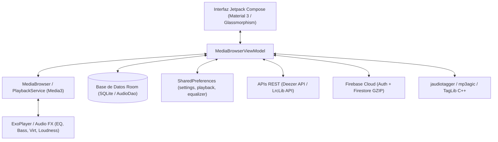
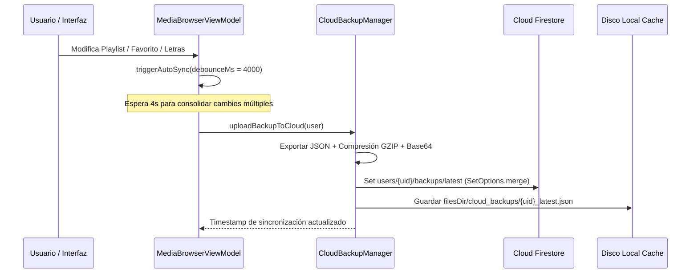

# 🎵 KevMusicPlayer — Contexto General del Proyecto (Single Source of Truth)

Este documento es la **Fuente Única de Verdad (Single Source of Truth)** para el proyecto Android **KevMusicPlayer**, un reproductor de música nativo de alto rendimiento con interfaz moderna en Jetpack Compose, sincronización de biblioteca y respaldo en la nube vía Google Firebase, personalización visual avanzada y soporte de efectos de sonido DSP a 120 FPS.

---

## 1. Propósito y Visión General
**KevMusicPlayer** es un reproductor de audio moderno, ligero y ultrarrápido desarrollado en **Kotlin y Jetpack Compose** para Android 13+ (API 33 a 37+). Su arquitectura está diseñada bajo la filosofía **Local-First**, ofreciendo una experiencia estética, fluida y altamente configurable sin depender de servicios de streaming externos.

### Pilares Funcionales:
1. **Biblioteca Local Inteligente:** Escaneo nativo con `MediaStore` y extracción de metadatos/etiquetas (ID3v1, ID3v2, FLAC, Vorbis, MP4) vía `jaudiotagger` y `mp3agic`.
2. **Sistema de Carga de Carátulas Multi-Nivel:** Arquitectura en 5 niveles de respaldo (RAM LruCache, Disco WebP, `loadThumbnail` acelerado por hardware, `MediaMetadataRetriever` protegido e imágenes de carpeta) con cero bloqueos y protección contra envenenamiento de caché.
3. **Sincronización y Respaldo en la Nube (Google Cloud / Firebase):** Inicio de sesión con Google (`GoogleSignInClient` + `FirebaseAuth`) y almacenamiento comprimido GZIP en Firestore de listas de reproducción, letras de canciones, estadísticas y configuraciones del usuario.
4. **Reproducción y Audio DSP:** Basado en `Jetpack Media3 / ExoPlayer` (`MediaSessionService`) con soporte para reproducción en segundo plano, controles de pantalla de bloqueo, integración de notificación multimedia nativa, ecualizador gráfico de 5 bandas, refuerzo de graves (*Bass Boost*), sonido envolvente virtualizado (*Virtualizer*), normalización de volumen (*ReplayGain*) y salto manual de pista instantáneo.
5. **Letras Sincronizadas y Traducidas:** Visualización y edición en tiempo real de letras sincronizadas (.lrc) o estáticas, con integración de búsqueda automática en línea (LrcLib API) y persistencia local/nube.
6. **Mantenimiento y Diagnóstico:** Herramientas integradas para detectar canciones duplicadas por hash/metadatos, verificar integridad de archivos corruptos, filtrar audios cortos (audios de WhatsApp/tonos) y descargar carátulas faltantes en HD desde Deezer API.
7. **KevMusic Wrapped (Historias Estilo Spotify Wrapped):** Resumen estadístico interactivo a pantalla completa con barras de progreso animadas, aura sonora, hábitos de escucha, arquetipos de personalidad y póster final exportable en PNG.
8. **Personalización Estética Neo-Glow / Glassmorphism:** Temas visuales (*Cyberpunk Rosa, Cyberpunk Púrpura, Azul Petróleo, Turquesa, Obsidiana AMOLED y Monocromo*), soporte de transparencia Glassmorphism en barra de navegación y tarjetas, fondo ambiental dinámico basado en los colores de la carátula, visualizador animado (FFT) y selector de tasa de refresco a **120 Hz**.

---

## 2. Stack Tecnológico y Arquitectura



- **Lenguaje:** 100% Kotlin (Coroutines, Flow, StateFlow).
- **UI Framework:** Jetpack Compose con Material 3 (`androidx.compose.material3`), Compose Animation, Compose Foundation, Compose Runtime.
- **Reproducción Multimedia:** `androidx.media3` (`media3-exoplayer`, `media3-session`, `media3-ui`, `media3-common`).
- **Base de Datos Local:** Android Room (`androidx.room:room-runtime`, `androidx.room:room-ktx`, KSP) en versión 10.
- **Backend y Nube:**
  - **Firebase Auth:** Autenticación con Google (`GoogleAuthProvider` + `GoogleSignInOptions`).
  - **Cloud Firestore:** Almacenamiento NoSQL de respaldos en la nube bajo `users/<userId>/backups/latest`.
  - **Firebase Storage / Google Services:** Integrados vía `google-services.json`.
- **Carga y Caché de Imágenes:** Coil Compose (`io.coil-kt:coil-compose`) + `LruCache` en memoria y almacenamiento WebP en disco.
- **Manipulación de Etiquetas:** `jaudiotagger` (`org.jaudiotagger:jaudiotagger:3.0.1`) y `mp3agic` (`com.mpatric:mp3agic:0.9.2`).
- **Consumo de APIs REST:** `OkHttp 4.12.0` y `kotlinx.serialization` (Deezer API, LrcLib API).

---

## 3. Estructura del Proyecto y Archivos Clave

El código fuente se encuentra estructurado modularmente en `app/src/main/java/com/kevshupp/kevmusicplayer/`:

```text
com/kevshupp/kevmusicplayer/
├── MainActivity.kt                      # Contenedor principal, flujo de Onboarding y navegación Navigation3
├── KevMusicPlayerApplication.kt         # Inicialización de Firebase, TelemetryLogger y ciclo de vida global
│
├── data/                               # Capa de Datos y Modelos
│   ├── AudioFile.kt                     # Entidad Room de canción local
│   ├── AudioDao.kt                      # DAO de Room para operaciones CRUD de biblioteca
│   ├── AppDatabase.kt                   # Base de datos SQLite Room (Versión 10)
│   ├── AudioScanner.kt                  # Escaneo inteligente de MediaStore
│   ├── CoverArtRepository.kt            # Búsqueda y descarga de carátulas en HD (Deezer API 1000x1000)
│   ├── ArtistImageHelper.kt             # Búsqueda, caché y filtrado estricto de fotos de artistas (Deezer API)
│   ├── LyricsRepository.kt              # Repositorio de letras sincronizadas (.lrc) y traducciones
│   ├── AppUpdater.kt                    # Comprobador y descargador de actualizaciones vía GitHub Releases
│   ├── TelemetryLogger.kt               # Registro seguro de errores y telemetría local
│   └── cloud/                           # Módulo de Autenticación y Nube
│       ├── CloudUser.kt                 # Modelo de usuario de Google/Firebase
│       ├── CloudAuthManager.kt          # Gestión de autenticación con Google Play Services
│       └── CloudBackupManager.kt        # Compresión GZIP y subida/restauración en Firestore
│
├── playback/                            # Capa de Reproducción y Servicio de Audio
│   ├── PlaybackService.kt               # MediaLibraryService en segundo plano (Media3 ExoPlayer)
│   ├── MediaBrowserViewModel.kt         # ViewModel central del reproductor y biblioteca
│   ├── AudioIOHelpers.kt                # Helpers de manipulación de archivos y ContentResolver
│   ├── SmartRules.kt                    # Reglas para listas inteligentes
│   └── managers/                        # Gestores especializados
│       ├── AudioEffectsManager.kt       # Ecualizador 5 bandas, BassBoost, Virtualizer y Loudness
│       ├── CrossfadeManager.kt          # Fundido suave y transiciones de volumen
│       ├── VolumeFadeHelper.kt          # Salto manual instantáneo y protección de audio focus
│       ├── AudioFocusHelper.kt          # Gestión de foco de audio y ducking
│       ├── QueueManager.kt              # Gestión de colas de reproducción y barajado de entropía
│       ├── PlaylistManager.kt           # Creación y persistencia de listas de reproducción
│       ├── TagEditorManager.kt          # Edición física de etiquetas ID3 y metadatos
│       ├── StorageToolsManager.kt       # Diagnóstico de duplicados, audios cortos e integridad
│       └── BackupManager.kt             # Exportación e importación de copias de seguridad locales
│
├── widget/                              # Widgets del Sistema Android
│   ├── MusicWidget.kt                   # Widget interactivo para pantalla de inicio
│   └── MusicWidgetReceiver.kt           # Receptor de eventos de widget
│
└── ui/                                  # Capa de Presentación (Jetpack Compose)
    ├── screens/
    │   ├── HomeScreen.kt                # Pantalla principal con saludo dinámico, avatar y favoritos
    │   ├── LibraryScreen.kt             # Explorador de biblioteca (Pistas, Artistas, Álbumes, Carpetas)
    │   ├── PlayerScreen.kt              # Reproductor expandido, carrusel de vinilo, fondo y letras
    │   ├── PlayerComponents.kt          # Componentes auxiliares del reproductor
    │   ├── SettingsScreen.kt            # Panel de ajustes centralizado (Hub + Subpáginas nativas)
    │   ├── MusicInsightsScreen.kt       # KevWrapped interactivo por historias (Estilo Spotify Wrapped)
    │   ├── UniversalSearchOverlay.kt    # Buscador universal de canciones, artistas y carpetas
    │   ├── BottomNavBar.kt              # Barra de navegación flotante y Mini-Reproductor Glassmorphism
    │   ├── LibraryComponents.kt         # Componentes reutilizables, rememberAlbumArt, ArtistImage y LruCache
    │   ├── dialogs/                     # Diálogos modales
    │   │   ├── UserProfileDialog.kt     # Perfil de usuario, cambio de foto y estado de la nube
    │   │   ├── TagEditorDialog.kt       # Editor avanzado de etiquetas de canciones
    │   │   ├── AlbumEditorDialog.kt     # Editor de álbumes y carátulas
    │   │   ├── AlbumCoverEditorDialog.kt# Selección y recorte de carátula de álbum
    │   │   ├── MissingCoverFinderDialog.kt # Descarga masiva de carátulas faltantes con Deezer
    │   │   ├── DuplicateFinderDialog.kt # Detección y limpieza de canciones duplicadas
    │   │   ├── SongIntegrityDialog.kt   # Verificación de archivos corruptos
    │   │   ├── ShortSongsDialog.kt      # Filtrado de audios de corta duración
    │   │   ├── SearchLyricsDialog.kt    # Búsqueda manual de letras en línea
    │   │   ├── SleepTimerDialog.kt      # Temporizador de apagado
    │   │   └── AudioSpecsDialog.kt      # Especificaciones técnicas de audio (códec, bitrate, hz)
    │   └── settings/                    # Secciones modulares de configuración
    │       ├── GeneralSettingsSection.kt
    │       ├── LibrarySettingsSection.kt
    │       ├── AudioSettingsSection.kt
    │       ├── PerformanceSettingsSection.kt
    │       ├── SystemSettingsSection.kt
    │       ├── AboutSettingsSection.kt  # Licencia MIT, Privacidad Local-First y Stack Tecnológico
    │       ├── CloudSyncCard.kt         # Tarjeta de estado de sincronización en la nube
    │       └── SettingsCommon.kt        # Helpers de diseño y colores para ajustes
    └── theme/
        ├── Color.kt                     # Paletas de color (Cyberpunk, Petrol, Turquoise, Obsidian, Mono)
        ├── Theme.kt                     # Configuración de MaterialTheme y Glassmorphism
        └── Type.kt                      # Tipografías del sistema
```

---

## 4. Funcionamiento de la Sincronización Automática (Cloud Sync)

La sincronización automática en la nube de **KevMusicPlayer** permite mantener listas de reproducción, letras, estadísticas y configuraciones sincronizadas entre dispositivos sin transferir archivos de audio pesados:



1. **Autenticación con Google:** Mediante `CloudAuthManager`, el usuario vincula su cuenta de Google (`GoogleSignInClient` + `FirebaseAuth`), obteniendo un identificador privado `user.uid`.
2. **Debouncing Inteligente (4 segundos):** Al realizar acciones consecutivas (ej. añadir 10 canciones seguidas a una lista), `triggerAutoSync()` espera 4000 ms para agrupar todas las operaciones en una única llamada a la red.
3. **Compresión GZIP en Memoria:** Reduce el tamaño del JSON de respaldo entre un 80% y 90% antes de subirlo a Firestore, ahorrando datos móviles y batería.
4. **Almacenamiento Privado en Firestore:** Se guarda exclusivamente en la ruta `users/<userId>/backups/latest` con reglas de seguridad que impiden el acceso a otros usuarios.
5. **Redundancia y Restauración:** Si no hay conexión o se restaura el backup en un dispositivo nuevo, `restoreBackupFromCloud()` descarga el paquete, lo descomprime y reconcilia las listas con las canciones presentes en el nuevo terminal.

---

## 5. Decisiones de Arquitectura y Reglas Críticas

### A. Autenticación con Google y Soporte Multi-Variante
- **Mecanismo:** Se utiliza `GoogleSignInOptions` + `GoogleSignIn.getClient` vinculado con `FirebaseAuth.signInWithCredential`.
- **Razón:** `CredentialManager` arroja fallos en compilaciones sideloaded y Debug (`No credentials available`). `GoogleSignInClient` es 100% estable y retrocompatible.
- **Variantes de compilación:**
  - **Release:** `com.kevshupp.kevmusicplayer` (distribución final).
  - **Debug:** `com.kevshupp.kevmusicplayer.debug` (icono con tuerca ⚙️ para permitir co-instalación simultánea en el mismo teléfono).
- **Huella digital SHA-1 común (`shared.keystore`):**
  ```text
  89:65:60:13:60:21:43:9E:12:A0:49:6E:73:F1:04:24:EE:2B:CC:AC
  ```
- **Web Client ID de OAuth:**
  ```text
  250307790225-2bf1g55v6md8j8du61le2h1q4nj84srh.apps.googleusercontent.com
  ```
- **FileProvider:** El `authorities` en el `AndroidManifest.xml` debe usar siempre `${applicationId}.fileprovider` para evitar conflictos de instalación `INSTALL_FAILED_CONFLICTING_PROVIDER`.

### B. Sistema de Carga y Caché de Carátulas (Album Art)
- **Cero archivos vacíos (0 bytes):** Bajo ninguna circunstancia se debe crear un archivo de 0 bytes en caché ante un error temporal.
- **Auto-recuperación:** Si la caché encuentra un archivo de 0 bytes residual, lo borra en el acto (`diskFile.delete()`) y reintenta la lectura real.
- **Cero contaminación de galería fotográfica:** Nunca se registran carátulas en `MediaStore.Images` ni se guardan imágenes sueltas en las carpetas públicas de música. Se guardan en almacenamiento privado (`context.filesDir/covers/`) y en subdirectorios ocultos protegidos (`.covers/` con archivo `.nomedia`), usando nombres sanitizados `cover_<artista>_<álbum>.jpg`.
- **Jerarquía de Carga:**
  1. `LruCache` en memoria RAM.
  2. Archivos WebP en disco (`cacheDir/album_art_thumbnails/`).
  3. `contentResolver.loadThumbnail()` (Nativo en Android 10+).
  4. Extracción de `MediaMetadataRetriever` sobre ruta física / descriptores.
  5. Imágenes en subcarpeta oculta `.covers/` y almacenamiento interno de la app.
  6. Análisis y extracción ID3/APIC/FLAC/MP4 vía Jaudiotagger sobre el archivo físico.
- **Proveedor Exclusivo de Carátulas Faltantes:** **Deezer API** (`api.deezer.com/search/album` y `api.deezer.com/search/track`) como fuente primaria y directa para carátulas en ultra alta definición (**1000x1000** `cover_xl`).

### C. Sistema de Fotos de Artistas ([ArtistImageHelper.kt](file:///home/kevin/Escritorio/Proyectos/kevmusicplayer/app/src/main/java/com/kevshupp/kevmusicplayer/data/ArtistImageHelper.kt))
- **Sanitización y Nombres Deterministas:** Nombres con caracteres Unicode y acentos (*Rosalía, Bad Bunny, Mägo de Oz, AC/DC*) se normalizan con *slug* seguro + hash MD5 (`slug_hash.jpg`), garantizando nombres de archivo válidos y sin colisiones.
- **Filtrado Estricto de Placeholders:** Exclusión automática de imágenes genéricas y placeholders vacíos de Deezer (hash MD5 nulo `d41d8cd98f00b204e9800998ecf8427e`, `/images/artist//`, `default-artist`).
- **User-Agent de Navegador:** Se utiliza un User-Agent estándar para evitar limitaciones de tasa de peticiones (Rate Limiting).

### D. Rendimiento de Reproducción y Salto de Pistas
- **Salto Manual Instantáneo:** Al pulsar "Siguiente" o "Anterior", `VolumeFadeHelper.performManualSkip()` ejecuta la transición de inmediato sin bucles lentos de desvanecimiento artificial.
- **Protección de AudioFX:** `PlaybackService` valida que `audioEffectsManager.currentAudioSessionId != sessionId` antes de reconfigurar los efectos de sonido DSP en transiciones de pista, evitando recreaciones nativas síncronas que bloqueen el audio.

### E. KevMusic Wrapped Interactivo
- **Formato Historias (Stories):** Modal interactivo con 7 diapositivas a pantalla completa con barras de progreso animadas en la cabecera.
- **Desglose:** Minutos totales escuchados, Aura Sonora y géneros en porcentaje, Hábitos musicales y reloj horario, Top 5 Canciones, Artista #1 coronado, Arquetipo de personalidad musical (*El Fan Devoto, El Melómano Búho, El Explorador Sónico, El Archivista Acústico*) y Póster Final compartible vía Intent directo de Android (`image/png`).

### F. Filosofía de Privacidad y Licencia
- **Licencia:** Distribuido bajo la Licencia **MIT (Código Abierto)**.
- **Privacidad Local-First:** Cero recopilación o venta de datos de telemetría a terceros. Todo el catálogo de canciones reside 100% en el dispositivo del usuario.

---

## 6. Sistema de Estilo Visual (Neo-Glow / Glassmorphism)

- **Temas Soportados:**
  1. *Cyberpunk Rosa (Default):* `#FFFF4081` (Primario Rosa Neón), `#B388FF` (Violeta), `#08090F` (Fondo Negro Espacial).
  2. *Azul Petróleo (Petrol):* `#00E5FF` (Cian Neón), `#0A1E24` (Azul Petróleo Oscuro).
  3. *Turquesa (Turquoise):* `#00F5D4` (Verde Turquesa Eléctrico), `#020E0C` (Negro Bosque).
  4. *Obsidiana AMOLED:* `#FFFFFF` (Blanco Puro), `#000000` (Negro Puro OLED para ahorro de batería).
  5. *Monocromo (Light):* `#000000` (Negro), `#FFFFFF` (Blanco Puro).
- **Formas y Redondeados:**
  - Contenedores principales: `RoundedCornerShape(32.dp)` o `28.dp`.
  - Tarjetas e ítems de lista: `RoundedCornerShape(16.dp)` a `20.dp`.
  - Botones y controles de reproducción: `CircleShape` o `RoundedCornerShape(12.dp)`.
- **Efecto de Cristal (Glassmorphism):** Activado dinámicamente mediante `LocalCardTransparencyEnabled`, aplicando capas translúcidas `surfaceVariant.copy(alpha = 0.25f - 0.35f)` sobre fondos dinámicos y degradados oscuros.
- **Tasa de Refresco:** Optimizado para pantallas a **120 Hz** con animaciones fluidas y soporte para desactivación manual en dispositivos de gama de entrada.

---

## 7. Automatización de Compilación y Publicación (CI/CD)

### Script de Publicación Local
Ubicado en `/home/kevin/Escritorio/publicar_release.sh` (con alias `release` en `~/.bashrc`):
1. Solicita el mensaje del cambio y el tipo de versión (*patch*, *minor* o *major*).
2. Incrementa automáticamente el `versionCode` (+1) y `versionName` en `app/build.gradle.kts`.
3. Realiza el commit, genera el tag de Git y ejecuta `git push origin main --tags`.

### GitHub Actions Workflow (`.github/workflows/release.yml`)
- Se dispara automáticamente al recibir un nuevo tag `v*` o vía `workflow_dispatch`.
- Decodifica el secreto `GOOGLE_SERVICES_JSON_BASE64` para generar `app/google-services.json` de forma segura.
- Compila con Gradle (`./gradlew assembleRelease`).
- Publica el APK firmado y optimizado en **GitHub Releases** adjuntando el changelog automático.

---

## 8. Registro de Optimizaciones Críticas de Rendimiento (120 FPS / Cero Lag)

1. **Pre-creación de `Brush` en Memoria (`getGradientForString`):** `GradientBrushes` se pre-crea como una lista inmutable estática (7 instancias únicas), evitando crear miles de objetos `Brush.linearGradient()` por segundo durante el desplazamiento rápido de listas en Compose.
2. **Cero Doble Consulta en `rememberAlbumArt`:** Comprobación directa en una sola pasada en composición (`mutableStateOf(albumArtCache.get(uriString))`), evitando llamadas redundantes a disco/MediaStore.
3. **Escalado Rápido para Extracción de Color Dominante (`rememberDominantColor`):** Escala el bitmap a 50×50 px antes de ejecutar `Palette.from(smallBitmap).generate()`, acelerando la extracción de color **~100x** sin afectar la precisión cromática y sin reciclar el bitmap original del caché.
4. **Salto Manual de Pista Instantáneo (`performManualSkip`):** Elimina los bucles lentos de desvanecimiento de volumen artificial en saltos manuales, ejecutando `player.seekToNextMediaItem()` de forma inmediata.
5. **Protección de Reconfiguración DSP en PlaybackService:** Valida `audioEffectsManager.currentAudioSessionId != sessionId` en transiciones de canción, previniendo recreaciones nativas síncronas que bloqueen el audio.
6. **Debouncing de Estado de Reproducción (`savePlaybackState`):** Aplica un debounce de 300 ms en `saveStateJob` para evitar escrituras masivas consecutivas en SharedPreferences durante eventos de reproducción rápida.
7. **Cero Bloqueo de Hilo Principal en Widget Glance (`updateWidgetState`):** La generación y redimensionado de carátulas para el widget del sistema ocurre 100% en `Dispatchers.IO` reutilizando el caché de memoria.
8. **Compilador Compose Optimizado en Debug:** Configurado `composeCompiler { includeSourceInformation = false }` en `build.gradle.kts` para eliminar metadatos pesados de depuración en el árbol composable, logrando 120 FPS constantes tanto en Debug como en Release.
9. **Filtrado Inteligente en Escaneo de Inicio:** `scanFiles()` realiza un `join()` en la carga inicial y solo actualiza el estado de la UI si existen discrepancias reales con la base de datos local (`localAudioFiles != updatedFilesList`), eliminando parpadeos de 0 cuadros al abrir la app.
10. **Sincronización Dual de Estadísticas (Foreground + Background):** `PlaybackService` registra de forma autónoma `incrementPlayCount()` en SQLite Room ante cada transición de pista en segundo plano/bloqueo de pantalla, mientras que `MediaBrowserViewModel` actualiza la memoria en 0 ms e invoca `refreshStatsFromDb()` al reanudar la app, garantizando que "Lo que más escuchas", "Historial" y "KevMusic Wrapped" siempre reflejen las reproducciones reales sin importar si la app estaba minimizada.
11. **Indexación Exacta de Duración y Búsqueda VBR (`Mp3Extractor.FLAG_ENABLE_INDEX_SEEKING`):** Configurado `DefaultExtractorsFactory` con indexación de tramas MP3 y búsqueda CBR habilitada en `DefaultMediaSourceFactory`, evitando que canciones VBR o sin cabecera Xing válida sean calculadas erróneamente con duraciones cortas (ej. 30 segundos) o cortadas antes de tiempo por el reproductor.
12. **Sincronización Personalizada en la Nube (Google Cloud Sync):** Control granular sobre frecuencia y disparadores de sincronización (`realtime` en tiempo real y al salir, `on_exit` al cerrar/minimizar la app, `daily` una vez al día, `manual` solo a petición), ahorro de datos móviles con filtro `syncWifiOnly` y selección específica de elementos a respaldar (Playlists y Favoritos, Letras y Traducciones, Estadísticas e Historial, Ajustes y Ecualizador).
